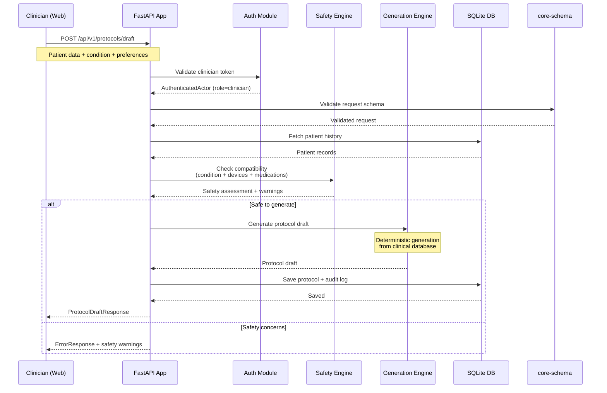
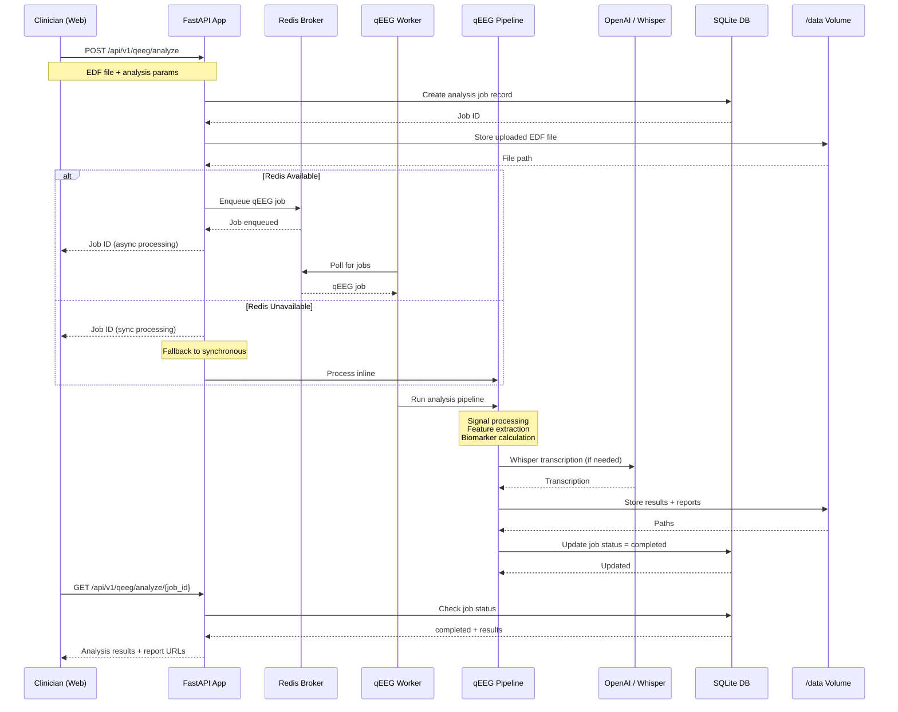
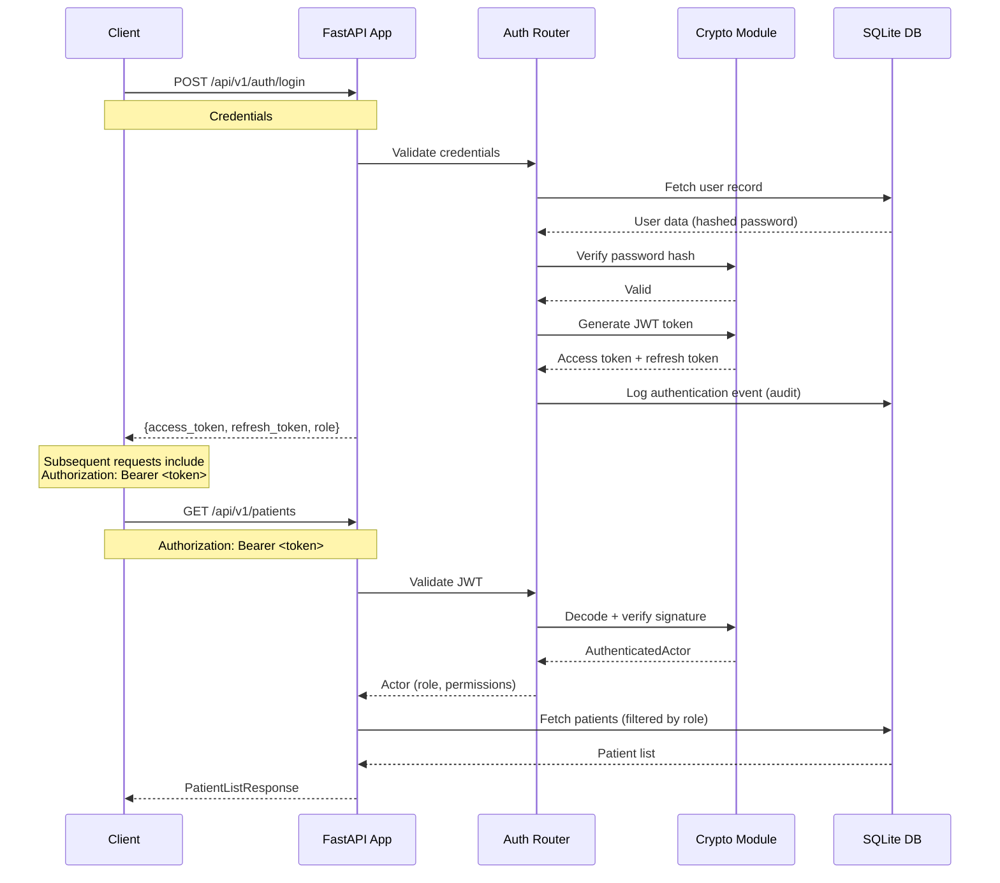
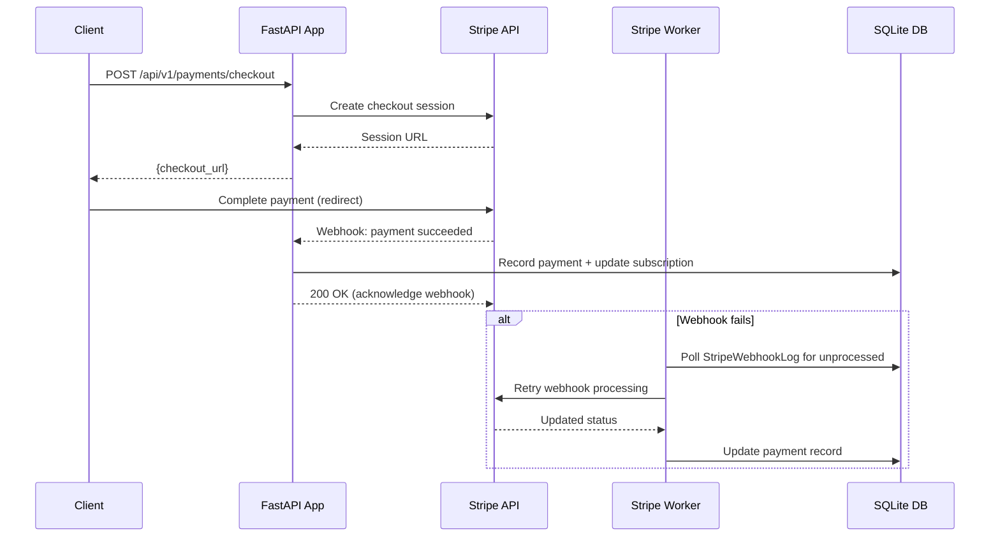
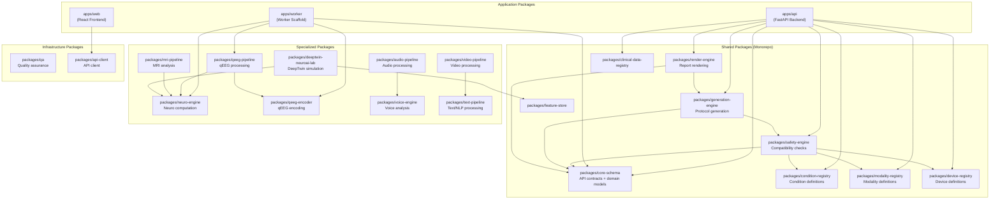
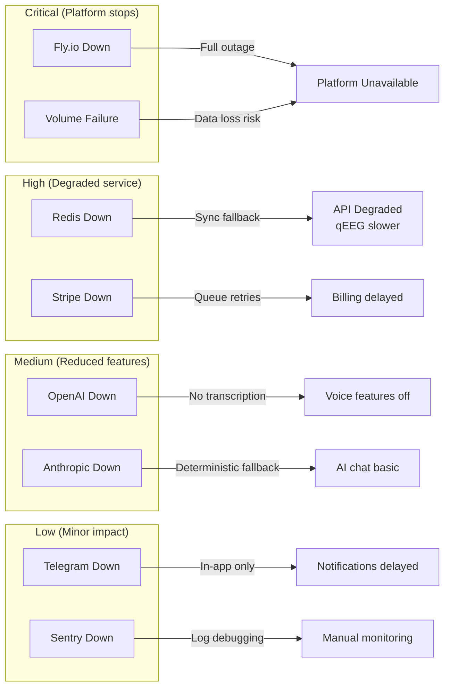
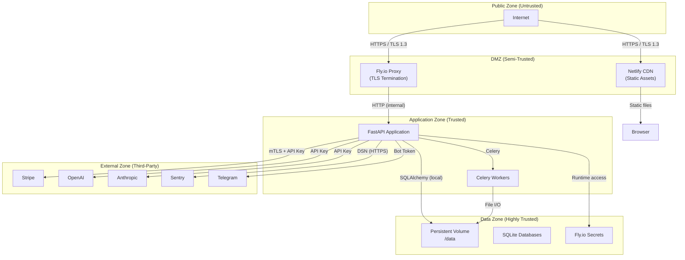
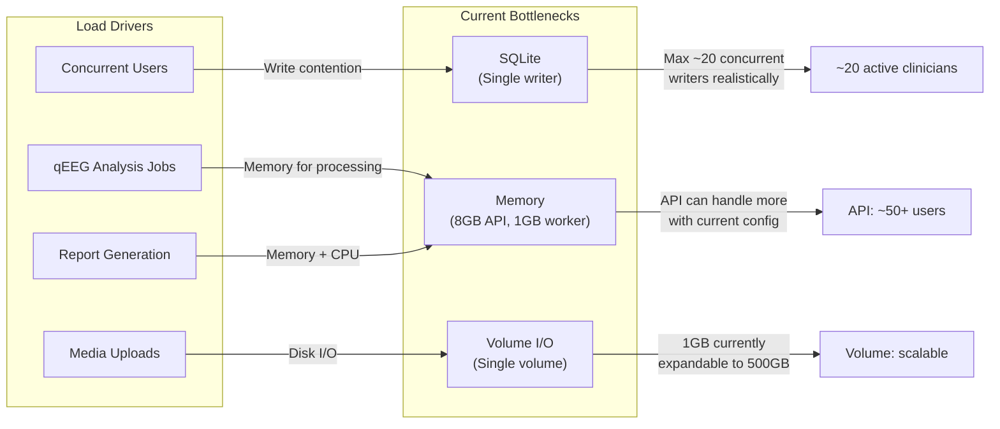

# System Architecture Overview — DeepSynaps Protocol Studio

> **Classification:** Architecture Documentation  
> **Owner:** Engineering Lead + SRE Lead  
> **Review Cycle:** Quarterly  
> **Last Updated:** 2026-05-14  
> **Status:** Current (as of production deployment)

---

## Table of Contents

1. [Component Diagram](#1-component-diagram)
2. [Data Flow Diagrams](#2-data-flow-diagrams)
3. [Dependency Map](#3-dependency-map)
4. [External Service Dependencies](#4-external-service-dependencies)
5. [Failure Domain Analysis](#5-failure-domain-analysis)
6. [Security Boundary Definitions](#6-security-boundary-definitions)
7. [Scaling Characteristics](#7-scaling-characteristics)

---

## 1. Component Diagram

### 1.1 High-Level Architecture (Mermaid)

```mermaid
graph TB
    subgraph "Client Layer"
        WEB["Web Frontend<br/>React + Vite<br/>Netlify"]
        CLI["CLI Tools"]
    end

    subgraph "Fly.io Platform (LHR Region)"
        subgraph "API Tier"
            LB["Fly Proxy<br/>Load Balancer<br/>:80 :443"]
            API1["FastAPI App<br/>performance-4x<br/>4 CPU / 8 GB"]
        end

        subgraph "Worker Tier"
            QW1["qEEG Worker<br/>shared-cpu-1x<br/>1 CPU / 1 GB"]
            SW1["Stripe Worker<br/>shared-cpu-1x<br/>1 CPU / 1 GB"]
        end

        subgraph "Data Tier"
            VOL["Persistent Volume<br/>/data<br/>1 GB+"]
            DB[("SQLite DB<br/>deepsynaps_protocol_studio.db")]
            EDB[("Evidence DB<br/>evidence.db")]
            MEDIA["/data/media_uploads"]
            VOICE["/data/voice"]
            SNAPS["/data/snapshots"]
            BACKUPS["/data/backups"]
        end
    end

    subgraph "External Services"
        REDIS["Redis / Upstash<br/>Celery Broker<br/>Rate Limiting"]
        STRIPE["Stripe<br/>Payments"]
        OPENAI["OpenAI<br/>Whisper / LLM"]
        ANTHR["Anthropic<br/>Claude / AI Chat"]
        SENTRY["Sentry<br/>Error Tracking"]
        TELEGRAM["Telegram<br/>Bot Notifications"]
        UPSTASH["Upstash<br/>(Redis-as-a-service)"]
    end

    subgraph "Package Ecosystem"
        CORE["core-schema"]
        CONDREG["condition-registry"]
        MODREG["modality-registry"]
        DEVREG["device-registry"]
        SAFETY["safety-engine"]
        GENENG["generation-engine"]
        RENDER["render-engine"]
        QEEGENC["qeeg-encoder"]
        QEEGPIPE["qeeg-pipeline"]
        NEUROENG["neuro-engine"]
    end

    WEB -->|"HTTPS / REST / SSE"| LB
    CLI -->|"REST API"| LB
    LB -->|"HTTP/1.1"| API1

    API1 -->|"SQLAlchemy"| DB
    API1 -->|"Read/Write"| VOL
    API1 -->|"Celery"| REDIS
    API1 -->|"Submit jobs"| QW1

    QW1 -->|"Process qEEG"| DB
    QW1 -->|"Store results"| VOL
    QW1 -->|"AI Analysis"| ANTHR

    SW1 -->|"Poll retries"| DB
    SW1 -->|"API calls"| STRIPE

    API1 -->|"Payments"| STRIPE
    API1 -->|"Transcription"| OPENAI
    API1 -->|"AI Chat"| ANTHR
    API1 -->|"Error reports"| SENTRY
    API1 -->|"Notifications"| TELEGRAM

    API1 --> CORE
    API1 --> CONDREG
    API1 --> MODREG
    API1 --> DEVREG
    API1 --> SAFETY
    API1 --> GENENG
    API1 --> RENDER

    QW1 --> QEEGPIPE
    QW1 --> QEEGENC
    QW1 --> NEUROENG
```



### 1.2 Component Descriptions

| Component | Technology | Purpose | Criticality |
|-----------|-----------|---------|-------------|
| **Web Frontend** | React + Vite | Clinician UI, patient portal, admin | High |
| **FastAPI App** | Python FastAPI | REST API, SSE, auth, business logic | **Critical** |
| **qEEG Worker** | Celery + Python | Async qEEG/ERP analysis pipeline | High |
| **Stripe Worker** | Python (cron loop) | Stripe webhook retry processing | Medium |
| **SQLite DB** | SQLite on volume | Primary application data | **Critical** |
| **Evidence DB** | SQLite on volume | Evidence/research data | Medium |
| **Persistent Volume** | Fly.io Volume | All durable storage | **Critical** |
| **Redis** | Redis / Upstash | Celery broker, rate limiting | High |

### 1.3 Process Groups (Fly.io)

```toml
# apps/api/fly.toml
[processes]
  # Public HTTP API server
  app = "uvicorn app.main:app --host 0.0.0.0 --port 8080 --app-dir apps/api"
  
  # Async qEEG/ERP analysis
  qeeg_worker = "sh -c 'PYTHONPATH=/app/apps/api celery -A app.jobs worker ...'"
  
  # Stripe webhook retry poller
  stripe_worker = "sh -c 'while true; do python scripts/retry_stripe_webhooks.py; sleep 300; done'"
```

---

## 2. Data Flow Diagrams

### 2.1 Patient Protocol Generation Flow



### 2.2 qEEG Analysis Flow



### 2.3 Authentication Flow



### 2.4 Payment Processing Flow



---

## 3. Dependency Map

### 3.1 Package Dependencies



### 3.2 Router Inventory (130+ Routers)

The FastAPI application (`apps/api/app/main.py`) mounts 130+ routers organized by domain:

| Domain | Router Files | Key Endpoints |
|--------|-------------|---------------|
| **Authentication** | `auth_router.py` | Login, logout, token refresh, 2FA |
| **Patient Management** | `patients_router.py`, `patient_*_router.py` | CRUD, portal, wearables, timeline |
| **Clinical** | `assessments_router.py`, `protocols_*_router.py`, `sessions_router.py` | Assessments, protocols, sessions |
| **qEEG** | `qeeg_analysis_router.py`, `qeeg_records_router.py`, `qeeg_*_router.py` | Analysis, records, visualizations |
| **Billing** | `payments_router.py`, `finance_router.py`, `agent_billing_router.py` | Stripe integration, billing |
| **Reporting** | `reports_router.py`, `outcomes_router.py` | Clinical reports, outcome tracking |
| **Research** | `research_consent_router.py`, `research_dataset_router.py` | Research data management |
| **Communication** | `telegram_router.py`, `notifications_router.py` | Bot notifications, SSE stream |
| **Admin** | `founder_dash_router.py`, `data_console_router.py`, `audit_trail_router.py` | Admin dashboards |
| **Safety** | `adverse_events_router.py`, `consent_router.py`, `quality_assurance_router.py` | Safety monitoring |
| **Media** | `media_router.py`, `voice_engine_router.py` | File uploads, voice analysis |
| **External** | `marketplace_router.py`, `virtual_care_router.py` | Marketplace, virtual visits |
| **AI** | `chat_router.py`, `ai_health_router.py` | AI chat, health analysis |
| **Specialized** | `brainmap_router.py`, `fusion_router.py`, `phenotype_router.py` | Brain mapping, data fusion |

---

## 4. External Service Dependencies

### 4.1 Dependency Matrix

| Service | Purpose | Criticality | SLA Target | Fallback |
|---------|---------|-------------|------------|----------|
| **Fly.io** | Hosting platform | **Critical** | 99.95% | Multi-region (future) |
| **Stripe** | Payment processing | High | 99.9% | Retry queue + offline billing |
| **Redis / Upstash** | Celery broker, rate limiting | High | 99.9% | Celery synchronous fallback |
| **OpenAI** | Whisper transcription, LLM | Medium | Best effort | Deterministic fallback |
| **Anthropic** | Claude AI chat | Medium | Best effort | Deterministic fallback |
| **Sentry** | Error tracking | Medium | 99.9% | Log-based debugging |
| **Telegram** | Bot notifications | Low | Best effort | In-app notifications |
| **Netlify** | Frontend hosting | High | 99.9% | N/A (static site) |

### 4.2 Dependency Failure Impact



### 4.3 External Service Health Monitoring

```bash
# Check external service status pages
curl -s https://status.stripe.com/api/v2/status.json | jq .status.description
curl -s https://status.openai.com/api/v2/status.json | jq .status.description
curl -s https://status.anthropic.com/api/v2/status.json | jq .status.description

# Fly.io status
curl -s https://status.flyio.net/api/v2/status.json | jq .status.description

# Custom health check (from our app)
curl -s https://deepsynaps-studio.fly.dev/health | jq .
```

---

## 5. Failure Domain Analysis

### 5.1 Failure Domains

A failure domain is a component or set of components that can fail independently.

| Domain | Components | Blast Radius | Mitigation |
|--------|-----------|--------------|------------|
| **API Server** | FastAPI app machine | All API requests | Auto-restart; scale to 2+ machines |
| **Worker Pool** | qEEG + Stripe workers | Async processing stops | Auto-restart; scale workers |
| **Database** | SQLite on volume | All data operations | Backups every 15 min; migrate to PostgreSQL |
| **Storage** | Fly.io volume | Data loss risk | Daily snapshots; 15-min DB backups |
| **Celery Broker** | Redis | Async jobs queue | Synchronous fallback |
| **Network** | Fly.io proxy | All external access | Multi-region (future) |
| **Auth** | JWT validation | Cannot authenticate users | JWT is stateless — no single point of failure |

### 5.2 Blast Radius Analysis

```mermaid
graph TB
    subgraph "Single Machine Failure"
        API_FAIL["API Machine Fails"]
        API_FAIL -->|"Fly proxy routes<br/>to new machine"| API_OK["Auto-start new machine"]
        API_FAIL -->|"< 30 sec downtime"| BLAST1["Blast: Brief interruption"]
    end

    subgraph "Volume Failure"
        VOL_FAIL["Volume Corruption"]
        VOL_FAIL -->|"Restore from backup"| VOL_OK["RPO: 15 min"]
        VOL_FAIL -->|"RTO: 30 min"| BLAST2["Blast: 30 min outage<br/>15 min data loss max"]
    end

    subgraph "Database Corruption"
        DB_FAIL["DB Corruption"]
        DB_FAIL -->|"Integrity check fails"| DB_STOP["Stop all writes"]
        DB_STOP -->|"Restore from backup"| DB_OK["RPO: 15 min"]
        DB_FAIL -->|"RTO: 30 min"| BLAST3["Blast: Clinical ops halted<br/>Last 15 min may need review"]
    end

    subgraph "Worker Failure"
        WORK_FAIL["All Workers Down"]
        WORK_FAIL -->|"API fallback to sync"| SYNC["qEEG runs inline"]
        WORK_FAIL -->|"Queue builds up"| QUEUE_BACKUP["Jobs queued in Redis"]
        WORK_FAIL -->|"< 10 min to recover"| BLAST4["Blast: Slower qEEG<br/>No async processing"]
    end

    subgraph "External Service Failure"
        EXT_FAIL["Stripe / OpenAI / Anthropic"]
        EXT_FAIL -->|"Graceful degradation"| DEGRADE["Fallback behavior"]
        EXT_FAIL -->|"No patient impact"| BLAST5["Blast: Reduced features<br/>Billing delayed"]
    end

    subgraph "Complete Region Failure"
        REG_FAIL["Fly.io LHR Region"]
        REG_FAIL -->|"Currently: single region"| OUTAGE["Full platform outage"]
        REG_FAIL -->|"Future: multi-region"| MULTI["Failover to backup region"]
        REG_FAIL -->|"Depends on Fly.io recovery"| BLAST6["Blast: Full outage<br/>Until Fly.io resolves"]
    end
```



### 5.3 Single Points of Failure

| SPOF | Risk Level | Mitigation Plan | Timeline |
|------|-----------|-----------------|----------|
| Single API machine (with auto-stop) | Medium | Set `min_machines_running=1` + scale to 2 | Short-term |
| SQLite database (single file) | **High** | Migrate to PostgreSQL with HA | **Immediate priority** |
| Single Fly.io volume | High | Daily volume snapshots + backups | Short-term |
| Single region (LHR) | Medium | Multi-region deployment | Medium-term |
| Redis (single instance) | Low | Upstash HA or Fly Redis HA | Short-term |

---

## 6. Security Boundary Definitions

### 6.1 Security Zones



### 6.2 Authentication Boundaries

| Boundary | Mechanism | Enforcement |
|----------|-----------|-------------|
| **Public → API** | JWT Bearer token | FastAPI dependency (`get_authenticated_actor`) |
| **API → Database** | SQLAlchemy ORM | Role-based query filtering |
| **API → External** | API keys per service | Secrets management (Fly.io secrets) |
| **Worker → Database** | Same as API | Shared SQLAlchemy models |
| **Admin → System** | Role-based access control | `admin-demo-token` server-side enforcement |

### 6.3 Data Classification

| Data Class | Examples | Storage | Encryption |
|------------|----------|---------|------------|
| **PHI / ePHI** | Patient records, EEG data, treatment history | SQLite on volume | At rest: volume-level; In transit: TLS 1.3 |
| **PII** | Clinician names, email, phone | SQLite on volume | At rest: volume-level; In transit: TLS 1.3 |
| **Financial** | Stripe tokens, payment history | SQLite + Stripe | Stripe handles card data (PCI DSS); tokens encrypted |
| **Authentication** | Password hashes, JWT secrets, 2FA secrets | SQLite + Fly secrets | Bcrypt hashes; Fernet-encrypted 2FA secrets |
| **Wearable Tokens** | OAuth tokens for device connections | SQLite | Fernet-encrypted at rest |
| **Audit Logs** | All API actions, access records | SQLite append-only | Integrity-protected |

### 6.4 Security Controls

| Control | Implementation | Status |
|---------|---------------|--------|
| **TLS in transit** | Fly.io terminates TLS 1.3 | Active |
| **JWT authentication** | HS256 with 256-bit secret | Active |
| **Role-based access control** | Server-side role enforcement | Active |
| **Rate limiting** | SlowAPI with Redis fallback | Active |
| **Request timeout** | 30-second ASGI timeout | Active |
| **Input validation** | Pydantic schemas on all endpoints | Active |
| **SQL injection prevention** | SQLAlchemy ORM (parameterized queries) | Active |
| **XSS protection** | React default escaping + CSP headers | Active |
| **Audit logging** | Structured request logging | Active |
| **Secret management** | Fly.io encrypted secrets | Active |
| **2FA support** | TOTP with Fernet-encrypted secrets | Active |

---

## 7. Scaling Characteristics

### 7.1 Scaling Dimensions

| Component | Scale Dimension | Current Limit | Scaling Method |
|-----------|----------------|---------------|----------------|
| **API Server** | Horizontal (machines) | 1 (SQLite limitation) | Fly `scale count` |
| **API Server** | Vertical (CPU/RAM) | performance-4x (4C/8GB) | Fly `vm` config |
| **qEEG Worker** | Horizontal | 1 | Fly `scale count` |
| **qEEG Worker** | Vertical | shared-cpu-1x (1C/1GB) | Fly `vm` config |
| **Stripe Worker** | Horizontal | 1 | Fly `scale count` |
| **Database** | Vertical (file size) | Limited by volume size | Volume expansion |
| **Storage** | Volume size | 1 GB+ | `fly volumes extend` |
| **Redis** | Vertical | Upstash plan limits | Upgrade plan |

### 7.2 Bottleneck Analysis



### 7.3 Scaling Roadmap

| Phase | Trigger | Action | Target Capacity |
|-------|---------|--------|-----------------|
| **Phase 0 (Now)** | Baseline | Current config | 1-5 clinics |
| **Phase 1** | 5+ clinics / CPU > 50% | Add API machine (requires PostgreSQL) | 10-20 clinics |
| **Phase 2** | 20+ clinics / qEEG queue > 50 | Scale workers + add Redis HA | 20-50 clinics |
| **Phase 3** | 50+ clinics | PostgreSQL HA + read replicas | 50-200 clinics |
| **Phase 4** | 200+ clinics | Multi-region deployment | 200+ clinics |

### 7.4 Cost-Scaling Relationship

| Clinics | API VMs | Workers | DB | Est. Monthly Cost |
|---------|---------|---------|----|-------------------|
| 1-5 | 1 x perf-4x | 2 x shared-1x | SQLite | $50-100 |
| 5-20 | 2 x perf-4x | 3 x shared-2x | PG Starter | $150-300 |
| 20-50 | 3 x perf-4x | 5 x shared-2x | PG Pro | $400-600 |
| 50-200 | 4+ x perf-8x | 8+ x perf-4x | PG Enterprise | $800-1500 |

---

## Quick Reference

```
ARCHITECTURE AT A GLANCE
-------------------------
Frontend:     React + Vite → Netlify
API:          FastAPI → Fly.io (performance-4x)
Workers:      Celery (qEEG + Stripe)
Database:     SQLite on Fly volume (→ PostgreSQL)
Storage:      Fly persistent volume (/data)
Cache/Broker: Redis / Upstash
Auth:         JWT (HS256) + role-based access
External:     Stripe, OpenAI, Anthropic, Sentry, Telegram

CRITICAL PATH: Client → Fly Proxy → FastAPI → SQLite → Volume
SINGLE POINTS OF FAILURE: SQLite, single volume, single region
IMMEDIATE PRIORITY: PostgreSQL migration for multi-machine scaling
```

---

## Cross-References

- [Incident Response Runbook](../runbooks/incident-response.md) — Failure response
- [On-Call Playbook](../runbooks/oncall-playbook.md) — Operational procedures
- [Capacity Planning Guide](../runbooks/capacity-planning.md) — Scaling decisions
- [Performance Tuning Guide](../runbooks/performance-tuning.md) — Optimization
- [SLA Definition](../operations/sla-definition.md) — Service targets
