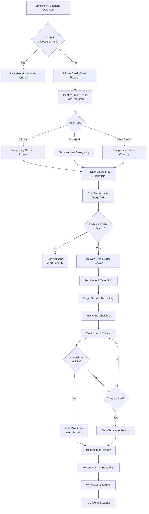
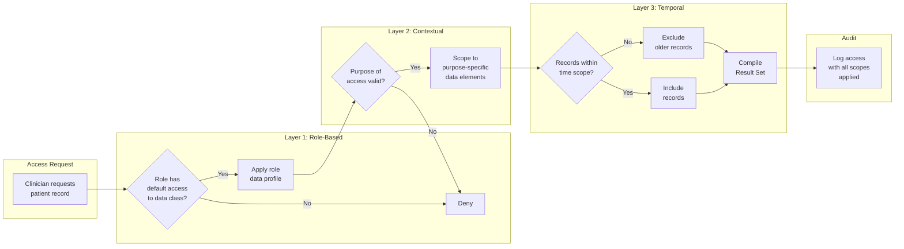
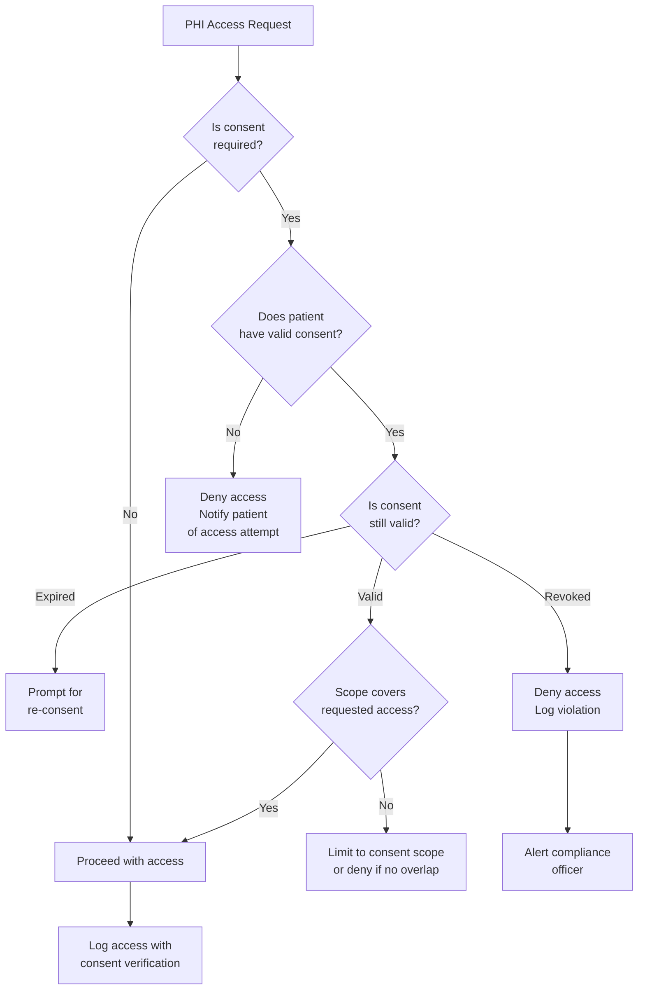
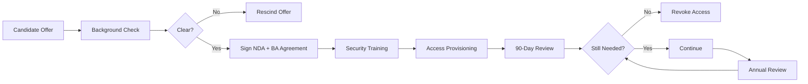
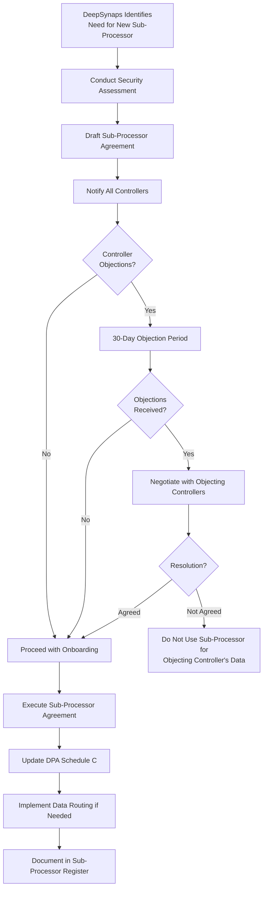
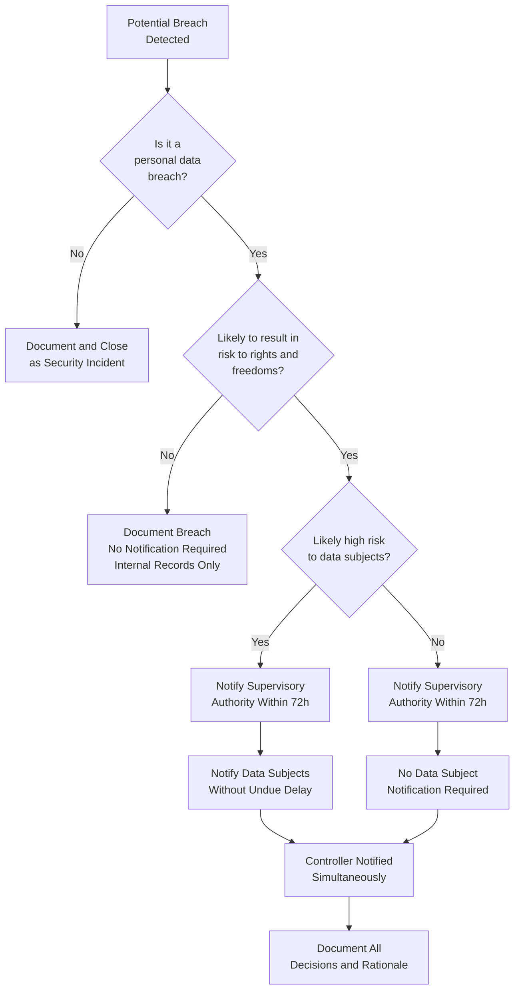

# DeepSynaps Protocol Studio: CRM Governance & Healthcare SaaS Super-Admin Architecture

## Comprehensive Research Report on Governance Models, Break-Glass Access Patterns, PHI Controls, HIPAA Safeguards, GDPR Relationships, Audit Trails, Incident Response & Compliance Dashboard Design

**Version:** 1.0.0
**Date:** 2026-01-12
**Classification:** Architecture & Governance Research
**Target Platform:** DeepSynaps Multi-Tenant Healthcare CRM
**Jurisdiction:** United States (HIPAA) / EU (GDPR) / Global Best Practices

---

## Table of Contents

1. [Super-Admin Governance Models](#1-super-admin-governance-models)
2. [Break-Glass Access Patterns](#2-break-glass-access-patterns)
3. [PHI Access Governance](#3-phi-access-governance)
4. [HIPAA Administrative Safeguards for SaaS](#4-hipaa-administrative-safeguards-for-saas)
5. [GDPR Controller-Processor Relationship](#5-gdpr-controller-processor-relationship)
6. [Audit Trail Requirements](#6-audit-trail-requirements)
7. [Incident Response](#7-incident-response)
8. [Compliance Dashboard Design](#8-compliance-dashboard-design)

---

## Executive Summary

Healthcare SaaS platforms operating as multi-tenant systems for clinical environments face unprecedented governance challenges. The DeepSynaps Protocol Studio CRM must reconcile the competing demands of operational efficiency—enabling super-administrators to manage hundreds or thousands of clinic tenants—with the stringent requirements of HIPAA's Administrative Safeguards, the GDPR's controller-processor framework, and emerging state-level privacy regulations. This report presents a comprehensive governance architecture that treats administrative privilege not as a convenience layer but as a critical security domain requiring its own Zero Trust model.

The research synthesizes industry best practices from HITRUST, NIST SP 800-53, ISO 27001, SOC 2 Type II, and real-world healthcare SaaS implementations (Epic, Cerner, Veradigm, Salesforce Health Cloud, and Veeva Systems). It produces actionable governance patterns, decision trees, flowcharts, and compliance checklists that can be directly translated into the DeepSynaps CRM's authorization subsystem, audit infrastructure, and compliance monitoring layer.

**Key Findings:**
- Super-admin access must be governed by Just-in-Time (JIT) elevation with time-bound sessions, dual authorization, and continuous re-verification
- Break-glass procedures require a dedicated subsystem with isolation from normal authentication pathways, mandatory session recording, and automated post-access review workflows
- PHI access governance must implement the Minimum Necessary Standard through attribute-based access control (ABAC) with purpose-of-use tagging
- HIPAA Administrative Safeguards §164.308 map directly to 22 implementable controls in a SaaS context
- The GDPR controller-processor relationship requires a Data Processing Agreement (DPA) with 14 mandatory provisions and a sub-processor approval workflow
- Audit trails must achieve blockchain-grade integrity through hash-chained logs with distributed witness nodes
- Incident response must include a 72-hour containment SLA for PHI breaches with automated regulatory notification pipelines
- The compliance dashboard must surface real-time risk indicators across six critical dimensions

---

## 1. Super-Admin Governance Models

### 1.1 Role Hierarchy Architecture

The DeepSynaps CRM implements a strict hierarchical role model with four principal tiers. This hierarchy is foundational to all access control decisions and must be encoded as a directed acyclic graph (DAG) in the authorization service.

#### 1.1.1 Tier Definitions

| Tier | Role | Scope | Capabilities |
|------|------|-------|-------------|
| T0 | Super-Admin (Platform) | Global across all clinic tenants | Tenant provisioning, system configuration, break-glass access, security policy enforcement, compliance monitoring, infrastructure management |
| T1 | Clinic-Admin | Single clinic tenant | User management within clinic, workflow configuration, report generation, billing administration, PHI access management for clinic staff |
| T2 | Clinician | Single or limited clinic assignment | Patient record access, treatment documentation, e-prescribing, appointment scheduling, care plan management |
| T3 | Patient | Own record only | Portal access, appointment viewing, messaging with providers, lab result viewing, consent management |

#### 1.1.2 Hierarchical Constraints

The hierarchy enforces the following invariant constraints:

**Constraint 1: No Privilege Escalation Through Delegation**
A principal at tier T_i cannot grant permissions exceeding their own tier's capabilities. Clinic-Admins cannot create Super-Admin accounts. Clinicians cannot create Clinic-Admins.

**Constraint 2: Scope Monotonicity**
The access scope is non-increasing as we descend the hierarchy. Super-Admins have global scope. Clinic-Admins have clinic-scoped access. Clinicians have patient-panel-scoped access. Patients have self-scoped access.

**Constraint 3: Separation of Privilege at Tier Boundaries**
Any cross-tier permission assignment requires dual authorization. A Super-Admin granting Clinic-Admin privileges to a user must be approved by a second Super-Admin from a different organizational unit (security team vs. operations team).

#### 1.1.3 Role Hierarchy Diagram

```
┌─────────────────────────────────────────────────────────────────────┐
│                    SUPER-ADMIN (PLATFORM)                           │
│  ┌─────────────┐  ┌─────────────┐  ┌─────────────┐               │
│  │  Security   │  │ Operations  │  │ Compliance  │               │
│  │   Officer   │  │   Manager   │  │   Officer   │               │
│  └──────┬──────┘  └──────┬──────┘  └──────┬──────┘               │
│         └─────────────────┴─────────────────┘                      │
│                           │                                        │
│              ┌────────────┼────────────┐                          │
│              ▼            ▼            ▼                          │
│         ┌─────────┐  ┌─────────┐  ┌─────────┐                   │
│         │ Clinic  │  │ Clinic  │  │ Clinic  │  ...               │
│         │Admin A  │  │Admin B  │  │Admin C  │                   │
│         └────┬────┘  └────┬────┘  └────┬────┘                   │
│              │            │            │                          │
│         ┌────┴────┐  ┌────┴────┐  ┌────┴────┐                   │
│         ▼    ▼    ▼  ▼    ▼    ▼  ▼    ▼    ▼                   │
│       [Clinician Pool - Per Clinic]                               │
│              │            │            │                          │
│         ┌────┴────┐  ┌────┴────┐  ┌────┴────┐                   │
│         ▼    ▼    ▼  ▼    ▼    ▼  ▼    ▼    ▼                   │
│       [Patient Population - Per Clinic]                            │
└─────────────────────────────────────────────────────────────────────┘
```

#### 1.1.4 Role Assignment Matrix

The following matrix defines which roles can assign which other roles:

| Assigning Role | Can Assign To | Requires Dual Auth | Max Assignments |
|---------------|--------------|-------------------|-----------------|
| Super-Admin (Security) | Clinic-Admin | Yes | Unlimited (within approval) |
| Super-Admin (Security) | Super-Admin (Operations) | Yes (2-of-3 Security Council) | 5 per region |
| Super-Admin (Operations) | Clinic-Admin | Yes | Unlimited (within approval) |
| Clinic-Admin | Clinician | No | Per clinic license limit |
| Clinic-Admin | Clinic-Admin (peer) | Yes | Per clinic policy |
| Clinician | Patient Portal Access | No | Per patient relationship |
| System (Auto-provisioning) | Patient | N/A | Self-registration + clinic invite |

### 1.2 Cross-Clinic Access Controls

Cross-clinic access is one of the highest-risk operations in a multi-tenant healthcare CRM. The following architecture prevents unauthorized cross-contamination of Protected Health Information (PHI) between clinic tenants.

#### 1.2.1 Tenant Isolation Model

DeepSynaps implements **hard tenant isolation** at three layers:

**Layer 1: Data Layer Isolation**
- Each clinic tenant has a dedicated database schema (PostgreSQL schema-per-tenant)
- Row-Level Security (RLS) policies enforce tenant_id filtering on every query
- Foreign keys across tenant boundaries are physically impossible
- Database connections are pooled per-tenant with distinct credentials

**Layer 2: Application Layer Isolation**
- The request context carries an immutable tenant_id set at authentication time
- Service-layer code cannot override the tenant_id without explicit break-glass elevation
- API endpoints reject requests where the JWT tenant claim does not match the resource tenant
- GraphQL resolvers validate tenant boundaries on every nested field access

**Layer 3: Infrastructure Layer Isolation**
- Clinic data at rest uses tenant-specific encryption keys (AES-256-GCM)
- Encryption keys are stored in a Hardware Security Module (HSM) with key derivation per tenant
- Backup and disaster recovery processes maintain tenant separation
- Log aggregation tags every entry with tenant_id for segmented access

#### 1.2.2 Cross-Clinic Access Patterns

Despite hard isolation, legitimate cross-clinic access scenarios exist:

**Pattern A: Multi-Site Clinic Organization**
When a single healthcare organization operates multiple clinics (e.g., a hospital system with 12 outpatient clinics), clinicians may need access to patient records across sites.

- Implementation: Organization-level umbrella tenant with site-level sub-tenants
- Access: Clinicians are granted cross-site permissions through ABAC policies
- Audit: All cross-site access is logged as HIGH severity with mandatory justification

**Pattern B: Referral Networks**
When Clinic A refers a patient to Clinic B, limited information sharing is required.

- Implementation: Secure referral gateway with document-level sharing
- Access: Time-limited share tokens with specific document scope
- Audit: Share creation, access, and revocation are all logged

**Pattern C: Break-Glass Cross-Tenant Access**
Emergency scenarios requiring Super-Admin access across tenants.

- Implementation: Dedicated break-glass subsystem (see Section 2)
- Access: JIT elevation with mandatory dual authorization
- Audit: Full session recording, real-time alerting, post-access review

#### 1.2.3 Cross-Clinic Access Decision Flow

```
┌─────────────────────────────────────────────────────────────────┐
│              CROSS-CLINIC ACCESS REQUEST                         │
│                    (API or UI Action)                            │
└────────────────────────────┬────────────────────────────────────┘
                             │
                             ▼
┌─────────────────────────────────────────────────────────────────┐
│  STEP 1: IDENTIFY SOURCE & TARGET TENANTS                        │
│  ┌──────────────┐              ┌──────────────┐                 │
│  │ Source Tenant │              │ Target Tenant │                 │
│  │   (tenant_A)  │              │   (tenant_B)  │                 │
│  └──────┬───────┘              └──────┬───────┘                 │
└─────────┼─────────────────────────────┼──────────────────────────┘
          │                             │
          ▼                             ▼
┌─────────────────────────────────────────────────────────────────┐
│  STEP 2: CHECK EXISTING PERMISSIONS                              │
│  ┌──────────────────────────────────────────────────────────┐   │
│  │  Does principal have explicit cross-tenant grant?        │   │
│  │  - Organization-level umbrella permission?               │   │
│  │  - Referral share token?                                 │   │
│  │  - Break-glass JIT elevation active?                     │   │
│  └────────────────────────────┬─────────────────────────────┘   │
└───────────────────────────────┼─────────────────────────────────┘
                                │
                    ┌───────────┴───────────┐
                    ▼                       ▼
┌─────────────────────────┐   ┌─────────────────────────────────┐
│        YES              │   │              NO                  │
│  Verify grant scope     │   │  Check break-glass eligibility   │
│  Check expiration       │   │  - Super-Admin role?             │
│  Log access with context│   │  - Emergency override available? │
│  Allow if valid         │   │  - Dual-auth possible?           │
└─────────────────────────┘   └─────────────────────────────────┘
```

### 1.3 Permission Inheritance Model

Permissions in the DeepSynaps CRM follow a **contextual inheritance model** that combines Role-Based Access Control (RBAC) with Attribute-Based Access Control (ABAC).

#### 1.3.1 RBAC Foundation

The RBAC layer defines static permission sets associated with each role:

```python
# RBAC Permission Set Definitions (Conceptual)
SUPER_ADMIN_PERMISSIONS = {
    "tenant": ["create", "read", "update", "delete", "suspend", "migrate"],
    "user": ["create", "read", "update", "delete", "impersonate", "unlock"],
    "security_policy": ["create", "read", "update", "deploy", "audit"],
    "system_config": ["read", "update", "backup", "restore"],
    "audit_log": ["read", "export", "verify_integrity"],
    "break_glass": ["initiate", "approve", "monitor", "terminate"],
    "phi": ["access_with_override", "anonymize", "export_compliance"]
}

CLINIC_ADMIN_PERMISSIONS = {
    "user": ["create_clinician", "create_staff", "read", "update", "delete", "deactivate"],
    "workflow": ["create", "read", "update", "delete", "deploy"],
    "report": ["create", "read", "schedule", "export"],
    "billing": ["read", "update", "export"],
    "phi": ["access_with_justification", "delegate_access"],
    "consent": ["read", "update", "revoke"]
}

CLINICIAN_PERMISSIONS = {
    "patient_record": ["create", "read", "update"],
    "treatment_plan": ["create", "read", "update"],
    "prescription": ["create", "read", "update", "cancel"],
    "appointment": ["create", "read", "update", "cancel"],
    "lab_order": ["create", "read", "update"],
    "message": ["create", "read", "send_patient"],
    "phi": ["access_for_treatment", "document"]
}

PATIENT_PERMISSIONS = {
    "own_record": ["read"],
    "lab_result": ["read"],
    "appointment": ["read", "create_request", "cancel_own"],
    "message": ["create", "read"],
    "consent": ["read", "grant", "revoke"],
    "billing": ["read"]
}
```

#### 1.3.2 ABAC Overlay

The ABAC layer dynamically adjusts permissions based on runtime attributes:

**Subject Attributes:**
- Current role and tier
- Time of day (business hours vs. after-hours access)
- Location (IP address, geolocation, known device)
- Authentication strength (password, MFA, hardware key)
- JIT elevation status (active, expired, never requested)
- Recent access history (anomalous pattern detection)

**Resource Attributes:**
- Tenant ownership
- Sensitivity classification (PHI, financial, operational)
- Patient consent status (full, limited, withdrawn)
- Data retention period (active, archived, pending deletion)
- Treatment relationship (patient under care, former patient, referral)

**Environment Attributes:**
- System health status (normal, degraded, maintenance)
- Security alert level (green, yellow, orange, red)
- Compliance audit mode (active audit may restrict certain operations)
- Break-glass activation status (emergency procedures active)

#### 1.3.3 Permission Resolution Algorithm

```
PERMISSION_RESOLUTION(principal, action, resource):
    1. Determine base_permissions = RBAC[principal.role]
    2. If resource.tenant != principal.tenant:
       a. Check cross_tenant_grant = CROSS_TENANT_PERMISSIONS[principal.id][resource.tenant]
       b. If cross_tenant_grant does not exist:
          i. If principal.role == "super_admin" AND break_glass_active:
             - Log break-glass usage
             - Apply break_glass scope limitations
          ii. Else: DENY
       c. base_permissions = INTERSECTION(base_permissions, cross_tenant_grant.scope)
    3. Evaluate ABAC policies:
       a. For each policy in ACTIVE_POLICIES:
          - If policy.matches(principal, resource, environment):
            base_permissions = policy.apply(base_permissions)
    4. If action NOT IN base_permissions: DENY
    5. Apply Minimum Necessary filter (see Section 3)
    6. Log access decision and context
    7. If DENY: increment failed_access counter for alerting
    8. Return ALLOW with scoped permissions
```

### 1.4 Just-in-Time (JIT) Access

Just-in-Time access is the cornerstone of the Super-Admin governance model. It eliminates standing privileged access and replaces it with time-bound, justification-required, approved-on-demand elevation.

#### 1.4.1 JIT Access Lifecycle

```
┌─────────────────────────────────────────────────────────────────────┐
│                    JIT ACCESS LIFECYCLE                             │
│                                                                     │
│  ┌─────────┐    ┌─────────┐    ┌─────────┐    ┌─────────┐        │
│  │ REQUEST │───▶│  PENDING │───▶│ APPROVED│───▶│  ACTIVE   │        │
│  │         │    │ REVIEW   │    │         │    │  SESSION   │        │
│  └─────────┘    └─────────┘    └─────────┘    └────┬────┘        │
│                                                     │              │
│                           ┌────────────────────────┘              │
│                           ▼                                       │
│                     ┌─────────┐    ┌─────────┐                   │
│                     │ EXPIRED │───▶│  REVIEW  │                   │
│                     │         │    │  (POST)  │                   │
│                     └─────────┘    └─────────┘                   │
│                          ▲                                        │
│                          │                                        │
│                     ┌─────────┐                                   │
│                     │ REVOKED │◄── Emergency termination           │
│                     │ (ADMIN) │                                   │
│                     └─────────┘                                   │
└─────────────────────────────────────────────────────────────────────┘
```

#### 1.4.2 JIT Request Requirements

Every JIT elevation request must include:

| Field | Description | Example |
|-------|------------|---------|
| Requestor Identity | Verified principal making request | super-admin@deepsynaps.com |
| Target Role | Role being requested | super-admin-break-glass |
| Justification | Free-text business justification | "Investigating potential data anomaly in tenant_482; patient records showing inconsistent timestamps" |
| Ticket Reference | Link to tracking ticket | SEC-2026-01142 |
| Requested Duration | Time window (max 4 hours) | 2 hours |
| Scope Limitation | Specific tenants/resources | tenant_482, audit_logs, patient_records |
| Second Approver | Pre-designated approving authority | chief-security-officer@deepsynaps.com |

#### 1.4.3 JIT Approval Workflow

```
JIT_APPROVAL_WORKFLOW:
    1. Requestor submits JIT request through secure portal
    2. System validates:
       a. Requestor has eligible base role
       b. No existing active JIT session for requestor
       c. Requested duration within policy limits
       d. Justification meets minimum length (50 chars)
       e. Ticket reference is valid and open
    3. System sends approval request to designated approver
    4. Approver receives notification (SMS + email + in-app)
    5. Approver reviews request context:
       - Requestor's recent activity
       - Related security alerts
       - Scope of requested access
    6. Approver decides:
       a. APPROVE: Grants elevation with optional reduced scope
       b. DENY: Elevation refused, logged, requestor notified
       c. ESCALATE: Forward to security council for review
    7. If APPROVED:
       a. System issues short-lived credential (JWT, 15-min expiry)
       b. Session monitoring begins (keystroke logging, screen capture)
       c. Real-time alerts configured for anomalous actions
       d. Auto-termination timer started
    8. Upon session end (expiry or termination):
       a. All elevated permissions revoked
       b. Session recording sealed and stored
       c. Post-access review task created
       d. Summary report sent to security team
```

#### 1.4.4 JIT Policy Configuration

```yaml
jit_access_policies:
  super_admin_break_glass:
    max_duration_minutes: 240
    default_duration_minutes: 60
    approval_required: true
    dual_authorization: true
    approver_pool: security_council
    session_recording: mandatory
    scope_limitation: required
    cooldown_after_expiry_minutes: 60
    max_sessions_per_day: 2
    allowed_hours:
      start: "00:00"
      end: "23:59"
    # But after-hours triggers additional alerting
    after_hours_alert_severity: critical

  clinic_admin_elevation:
    max_duration_minutes: 120
    default_duration_minutes: 30
    approval_required: true
    dual_authorization: false
    approver_pool: clinic_supervisor
    session_recording: optional
    scope_limitation: clinic_only
    cooldown_after_expiry_minutes: 30
    max_sessions_per_day: 5

  clinician_emergency_override:
    max_duration_minutes: 30
    default_duration_minutes: 15
    approval_required: false
    dual_authorization: false
    auto_justification: emergency_phi_access
    session_recording: mandatory
    scope_limitation: patient_specific
    requires_emergency_code: true
    alert_severity: high
    post_access_review_within_hours: 24
```

### 1.5 Privilege Escalation Monitoring

Privilege escalation—both legitimate (JIT) and malicious—is one of the most critical events to monitor in the DeepSynaps CRM.

#### 1.5.1 Escalation Detection Rules

| Rule ID | Description | Severity | Trigger | Response |
|---------|------------|----------|---------|----------|
| ESC-001 | Standing super-admin access used | HIGH | Super-admin login without JIT | Require JIT enrollment; alert security |
| ESC-002 | JIT request outside business hours | MEDIUM | Request time not in 9-5 window | Require secondary approval; increase monitoring |
| ESC-003 | Rapid successive JIT requests | HIGH | 3+ requests in 24 hours | Temporarily suspend JIT eligibility; manual review |
| ESC-004 | JIT scope expansion attempt | CRITICAL | Requested scope exceeds normal pattern | Auto-deny; immediate security alert |
| ESC-005 | Concurrent JIT sessions | CRITICAL | Same requestor has 2+ active sessions | Auto-terminate all sessions; lock account |
| ESC-006 | JIT approver anomaly | HIGH | Approver approving own reports | Require cross-team approval; log for audit |
| ESC-007 | Elevated session unusual actions | CRITICAL | PHI bulk export during JIT | Auto-terminate; immediate investigation |
| ESC-008 | Escalation to data deletion | CRITICAL | Delete operations during elevation | Require explicit re-auth per action |
| ESC-009 | Cross-tenant JIT without referral | HIGH | JIT spanning >3 tenants | Security council approval required |
| ESC-010 | JIT session from unknown device | MEDIUM | New device fingerprint | Step-up authentication; device registration |

#### 1.5.2 Escalation Monitoring Architecture

```
┌─────────────────────────────────────────────────────────────────────┐
│              PRIVILEGE ESCALATION MONITORING                         │
│                                                                     │
│   ┌──────────────┐    ┌──────────────┐    ┌──────────────┐         │
│   │   API Gateway │    │  Auth Service │    │ Audit Pipeline │        │
│   │              │    │              │    │               │        │
│   │ - All requests│───▶│ - AuthN/AuthZ │───▶│ - Event stream │        │
│   │   tagged with│    │ - JIT check   │    │ - Real-time    │        │
│   │   principal  │    │ - Scope check │    │   enrichment   │        │
│   └──────────────┘    └──────────────┘    └───────┬───────┘        │
│                                                    │                 │
│                            ┌───────────────────────┘                 │
│                            ▼                                         │
│                   ┌──────────────────┐                              │
│                   │  Detection Engine  │                              │
│                   │                   │                              │
│                   │ ┌──────────────┐ │                              │
│                   │ │ Rule Engine  │ │◄── ESC-001 through ESC-010   │
│                   │ │ (Flink/Spark)│ │                              │
│                   │ └──────┬───────┘ │                              │
│                   │        │         │                              │
│                   │ ┌──────┴───────┐ │                              │
│                   │ │ ML Anomaly   │ │◄── Behavioral baseline       │
│                   │ │ Detection    │ │    deviation detection        │
│                   │ └──────┬───────┘ │                              │
│                   └────────┼─────────┘                              │
│                            │                                         │
│              ┌─────────────┼─────────────┐                         │
│              ▼             ▼             ▼                         │
│        ┌─────────┐  ┌──────────┐  ┌──────────┐                    │
│        │  Alert  │  │ Auto-    │  │ Case     │                    │
│        │  Manager │  │ Response │  │ Manager  │                    │
│        │         │  │          │  │          │                    │
│        │ PagerDuty│  │ - Terminate│ │ - Create │                    │
│        │ Email   │  │   session │  │   ticket │                    │
│        │ SMS     │  │ - Lock    │  │ - Assign │                    │
│        │ Slack   │  │   account │  │   analyst│                    │
│        └─────────┘  └──────────┘  └──────────┘                    │
└─────────────────────────────────────────────────────────────────────┘
```

#### 1.5.3 Behavioral Baseline for Escalation Detection

The system maintains behavioral baselines per principal:

```yaml
behavioral_baselines:
  per_principal:
    - normal_access_times: ["09:00-17:00"]
    - normal_tenants_accessed: ["tenant_001", "tenant_002"]
    - normal_operations: ["read_patient", "update_treatment", "schedule_appointment"]
    - normal_data_volume: "50 records/day"
    - normal_devices: ["device_fingerprint_abc123"]
    - normal_locations: ["IP_range_corporate"]

  anomaly_scoring:
    time_anomaly: +10 points
    new_tenant_access: +20 points
    unusual_operation: +15 points
    volume_spike_2x: +10 points
    volume_spike_10x: +30 points
    unknown_device: +15 points
    unknown_location: +20 points
    cross_tenant_bulk_access: +40 points

  alert_thresholds:
    low: 25 points
    medium: 50 points
    high: 75 points
    critical: 100 points
```

---

## 2. Break-Glass Access Patterns

Break-glass access refers to emergency procedures that allow authorized personnel to bypass normal access controls when standard mechanisms are unavailable or insufficient. In healthcare SaaS, break-glass is essential for patient safety scenarios (e.g., a clinician needs emergency access to records during a system outage) and for security incident response.

### 2.1 Break-Glass Access Principles

The DeepSynaps CRM break-glass system adheres to the following principles:

| Principle | Description |
|-----------|-------------|
| **Emergency Only** | Break-glass is exclusively for situations where normal access controls cannot satisfy patient safety or system security requirements |
| **Always Auditable** | Every break-glass access is comprehensively logged, recorded, and reviewed |
| **Minimal Scope** | Break-glass access is granted at the minimum scope necessary for the emergency |
| **Time-Bound** | All break-glass access has hard time limits that cannot be extended without new authorization |
| **Dual Control** | Break-glass activation requires at least two authorized individuals |
| **Notification** | Relevant stakeholders are notified immediately upon break-glass activation |
| **Post-Review** | Every break-glass session triggers a mandatory post-access review |

### 2.2 Emergency Access Procedures

#### 2.2.1 Break-Glass Activation Triggers

Break-glass access may be activated in the following scenarios:

**Category A: Patient Safety Emergency**
- Unconscious patient presented to emergency department; immediate access to medical history required
- Critical lab values require immediate clinician notification but system is unavailable
- Medication allergy information needed during emergency procedure
- Pregnancy/contraindication data required for emergency treatment

**Category B: System Availability Emergency**
- Primary authentication system failure preventing all clinician access
- Database corruption requiring recovery and verification
- Ransomware or other cyberattack requiring incident response access
- Critical patch deployment requiring direct system access

**Category C: Compliance/Legal Emergency**
- Court order requiring immediate data production
- Regulatory inspection requiring immediate record retrieval
- Subpoena compliance with strict deadline
- Mandatory reporting obligation (e.g., infectious disease outbreak)

**Category D: Administrative Emergency**
- Compromised clinic-admin account requiring immediate lockdown
- Erroneous data deletion requiring emergency recovery
- Misconfigured security policy blocking legitimate access
- Tenant migration requiring direct intervention

#### 2.2.2 Break-Glass Activation Flow



#### 2.2.3 Break-Glass Credential Types

The DeepSynaps CRM implements three types of break-glass credentials, each with distinct security properties:

**Type 1: Hardware Token-Based (Highest Security)**
- Physical hardware security tokens (YubiKey HSM) stored in sealed envelopes
- Envelopes stored in dual-control safe (two combinations required)
- Tokens pre-registered to specific super-admin identities
- Tokens automatically disabled after single use or time expiry
- Token usage triggers immediate high-priority alerts

**Type 2: Offline Certificate-Based**
- Pre-generated X.509 certificates on encrypted USB drives
- Drives stored in geographically separated locations
- Certificates have embedded validity windows (e.g., Jan 2026 - Dec 2026)
- Certificate revocation list (CRL) checked before each use
- Usage requires biometric + PIN authentication

**Type 3: Split-Knowledge Password (Emergency Only)**
- Password split into two parts, each held by different officers
- Parts combined through secure portal (never revealed in plaintext)
- One-time use passwords generated upon combination
- Valid for maximum 30 minutes
- Only usable from designated emergency workstations

### 2.3 Dual Authorization

Dual authorization (two-person control) is mandatory for all break-glass access.

#### 2.3.1 Dual Authorization Models

**Model A: Sequential Approval (Standard)**
```
Requestor ──▶ Primary Approver ──▶ Secondary Approver ──▶ Access Granted
              (Security Officer)   (Compliance Officer)
```

**Model B: Simultaneous Approval (High-Risk)**
```
                   ┌─────────────────▶ Approval A
                   │
Requestor ──▶ BOTH REQUIRED ──┤
                   │
                   └─────────────────▶ Approval B
                   │
                   └─────────────────▶ Access Granted (only if both within 15 min)
```

**Model C: M-of-N Threshold (Critical)**
```
Security Council: 5 members
Threshold: 3-of-5 required for activation
Any 3 council members must approve within 30-minute window
```

#### 2.3.2 Dual Authorization Implementation

```python
class DualAuthorizationEngine:
    """
    Implements dual authorization for break-glass access.
    """

    def __init__(self, requestor, requested_role, justification):
        self.requestor = requestor
        self.requested_role = requested_role
        self.justification = justification
        self.approvals = []
        self.status = "PENDING"
        self.created_at = datetime.utcnow()
        self.expires_at = self.created_at + timedelta(minutes=30)

    def submit_approval(self, approver, approval_type, biometric_token):
        """
        Submit an approval for the break-glass request.
        """
        # Validate approver is eligible
        if not self.is_authorized_approver(approver):
            raise UnauthorizedApproverError(
                f"Principal {approver.id} is not an authorized approver"
            )

        # Prevent self-approval
        if approver.id == self.requestor.id:
            raise SelfApprovalError("Requestor cannot approve their own request")

        # Prevent duplicate approval from same approver
        if any(a.approver.id == approver.id for a in self.approvals):
            raise DuplicateApprovalError("Approver has already submitted approval")

        # Verify biometric token
        if not self.verify_biometric(approver, biometric_token):
            raise BiometricVerificationError("Biometric verification failed")

        # Record approval
        approval = ApprovalRecord(
            approver=approver,
            timestamp=datetime.utcnow(),
            approval_type=approval_type,
            biometric_hash=hash(biometric_token)
        )
        self.approvals.append(approval)

        # Check if threshold met
        if self.check_threshold():
            self.status = "APPROVED"
            self.activate_break_glass()

        return self.status

    def check_threshold(self):
        """
        Check if required approval threshold is met.
        """
        required_model = self.get_authorization_model()

        if required_model == "sequential":
            # Both approvers must have approved in sequence
            return len(self.approvals) >= 2

        elif required_model == "simultaneous":
            # Both must approve within 15-minute window
            if len(self.approvals) >= 2:
                timestamps = sorted([a.timestamp for a in self.approvals])
                return (timestamps[-1] - timestamps[0]) <= timedelta(minutes=15)
            return False

        elif required_model.startswith("threshold"):
            # M-of-N threshold
            _, m, n = required_model.split(":")
            return len(self.approvals) >= int(m)

        return False

    def activate_break_glass(self):
        """
        Activate break-glass session after threshold met.
        """
        session = BreakGlassSession(
            requestor=self.requestor,
            approvals=self.approvals,
            role=self.requested_role,
            scope=self.calculate_scope(),
            started_at=datetime.utcnow(),
            expires_at=datetime.utcnow() + self.requested_role.max_duration,
            session_id=generate_cryptographic_session_id()
        )

        # Begin recording
        session.start_recording()

        # Notify all stakeholders
        self.notify_stakeholders(session)

        # Start real-time monitoring
        session.begin_monitoring()

        return session
```

### 2.4 Time-Limited Sessions

All break-glass sessions have hard time limits that cannot be overridden.

#### 2.4.1 Session Duration Tiers

| Scenario Type | Maximum Duration | Extension Allowed | Auto-Warning |
|--------------|------------------|-------------------|--------------|
| Patient safety emergency | 4 hours | No | 15 min before expiry |
| System recovery | 8 hours | Yes (requires new approval) | 30 min before expiry |
| Incident response | 12 hours | Yes (security council only) | 30 min before expiry |
| Compliance emergency | 2 hours | No | 15 min before expiry |
| Administrative recovery | 2 hours | Yes (single additional approval) | 10 min before expiry |

#### 2.4.2 Session Lifecycle State Machine

```
                    ┌─────────────┐
                    │   PENDING   │
                    │  (Created)  │
                    └──────┬──────┘
                           │
                    ┌──────▼──────┐
              ┌────▶│   ACTIVE    │◀────┐
              │     │  (Approved) │     │
              │     └──────┬──────┘     │
              │            │             │
        ┌─────┴─────┐ ┌────▼────┐ ┌────┴─────┐
        │ EXPIRED   │ │ REVOKED │ │ TERMINATED│
        │ (Auto)    │ │ (Admin) │ │ (Anomaly) │
        └─────┬─────┘ └────┬────┘ └────┬─────┘
              │            │            │
              └────────────┼────────────┘
                           │
                    ┌──────▼──────┐
                    │   CLOSED    │
                    │  (Reviewed) │
                    └─────────────┘
```

#### 2.4.3 Session Auto-Termination Rules

The following conditions trigger automatic session termination:

| Condition | Action | Notification |
|-----------|--------|--------------|
| Hard time limit reached | Immediate termination, session sealed | All approvers, security team, compliance |
| Anomalous activity score exceeds 100 | Immediate termination, account locked | Security team, SOC |
| Requestor's primary account compromised | Immediate termination, all sessions revoked | Security team, requestor |
| System enters maintenance mode | Graceful termination in 5 minutes | Requestor |
| Security alert level raised to RED | Immediate termination of all break-glass | All active users, security council |
| Approver revokes approval | Immediate termination | Requestor, security team |
| Dual-control safe opened (physical) | All token-based sessions terminated | Security team |

### 2.5 Justification Requirements

Every break-glass access requires documented justification that withstands post-hoc scrutiny.

#### 2.5.1 Justification Fields

| Field | Required | Description | Validation |
|-------|----------|-------------|------------|
| Emergency Type | Yes | Category from approved list | Must be A, B, C, or D |
| Patient ID | Conditional | If clinical emergency | Must be valid patient in system |
| Incident Ticket | Yes | Reference to tracking ticket | Must exist and be open |
| Detailed Narrative | Yes | Free-text explanation | Min 100 characters, must describe specific situation |
| Estimated Impact | Yes | Consequence if access denied | Min 50 characters |
| Alternative Attempts | Yes | What was tried before break-glass | Must list at least one alternative |
| Expected Duration | Yes | How long access needed | Must be <= max for scenario type |
| Legal Basis | Conditional | If compliance/legal emergency | Statute, regulation, or court order reference |

#### 2.5.2 Justification Template

```
BREAK-GLASS JUSTIFICATION TEMPLATE
====================================

Emergency Type: [ ] Patient Safety  [ ] System Availability
               [ ] Compliance/Legal  [ ] Administrative

Ticket Reference: _______________

Patient ID (if applicable): _______________

DETAILED NARRATIVE:
[Minimum 100 characters. Describe the specific situation requiring
break-glass access, including what data/systems are needed and why.]

ESTIMATED IMPACT IF ACCESS DENIED:
[Minimum 50 characters. Describe patient safety, legal, or operational
consequences of not granting this access.]

ALTERNATIVE ACCESS METHODS ATTEMPTED:
[ ] Standard login portal
[ ] Password reset
[ ] Account unlock through clinic-admin
[ ] Different device/network
[ ] Other: _______________

None of the above were successful because:
_____________________________________________

REQUESTED DURATION: ___ hours ___ minutes

LEGAL BASIS (if applicable): _______________

I certify that this request is made in good faith for the stated
emergency purpose and that I will access only the minimum information
necessary to resolve the emergency.

Requestor Digital Signature: _______________  Date/Time: _______________
```

### 2.6 Automatic Notifications

Break-glass access triggers a cascade of automatic notifications to ensure transparency and enable rapid response to misuse.

#### 2.6.1 Notification Recipients

| Event | Primary Recipients | Secondary Recipients | Timing |
|-------|-------------------|---------------------|--------|
| Break-glass requested | Requestor, designated approvers | Security team lead | Immediate |
| First approval received | Second approver, security team | Compliance officer | Immediate |
| Session activated | All approvers, requestor | Clinic-admin of affected tenant, SOC | Within 30 seconds |
| Anomalous activity detected | Security team, SOC | CISO, affected clinic-admin | Immediate |
| Session terminated (normal) | Requestor | All approvers, security team | Immediate |
| Session terminated (anomaly) | Security team, CISO | Legal, compliance, affected clinic-admin | Immediate |
| Post-access review created | Assigned reviewer | Security team, compliance | Within 1 hour of close |
| Review completed | Security team | Compliance officer | Upon completion |

#### 2.6.2 Notification Channels

```yaml
notification_config:
  channels:
    - channel: pagerduty
      severity: critical
      events: [session_activated, anomaly_detected, emergency_termination]
      escalation_policy: security_on_call

    - channel: sms
      severity: high
      events: [session_activated, anomaly_detected]
      recipients: [approvers, security_team_leads]

    - channel: email
      severity: medium
      events: [all_events]
      recipients: [all_stakeholders]

    - channel: slack
      severity: high
      events: [session_activated, anomaly_detected, session_closed]
      channel: "#security-alerts"

    - channel: audit_log
      severity: all
      events: [all_events]
      destination: immutable_audit_stream

    - channel: webhook
      severity: critical
      events: [session_activated, emergency_termination]
      endpoint: "https://soc.deepsynaps.com/api/alerts"
```

### 2.7 Post-Access Review

Every break-glass session triggers a mandatory post-access review workflow.

#### 2.7.1 Review Timeline

```
T+0:    Session ends (expiry or termination)
T+1h:   Review task auto-created and assigned
T+4h:   Initial reminder sent to reviewer
T+24h:  Escalation to security team lead if not completed
T+48h:  Escalation to CISO if not completed
T+72h:  Auto-escalated to compliance incident if not completed
```

#### 2.7.2 Review Checklist

```markdown
## Break-Glass Post-Access Review Checklist

### Session Information
- [ ] Session ID recorded and matches activation log
- [ ] Requestor identity verified and authenticated
- [ ] Both approvers' identities verified
- [ ] Approval timestamps within valid window
- [ ] Justification documentation complete and legible
- [ ] Ticket reference validated and linked

### Scope Verification
- [ ] Accessed resources match requested scope
- [ ] No unauthorized tenant access detected
- [ ] No unauthorized resource types accessed
- [ ] Data volume accessed consistent with stated purpose
- [ ] No bulk exports or downloads detected (unless authorized)

### Activity Review
- [ ] Session recording reviewed in full
- [ ] All actions consistent with stated emergency
- [ ] No anomalous patterns detected
- [ ] No data modification without documented reason
- [ ] No credential creation or privilege escalation during session

### Compliance Assessment
- [ ] Access justified under Minimum Necessary Standard
- [ ] Patient notification required and sent (if applicable)
- [ ] HIPAA breach assessment completed (if PHI accessed)
- [ ] GDPR Article 33 assessment completed (if EU data)
- [ ] State law notification requirements assessed

### Follow-Up Actions
- [ ] Any anomalies documented and investigated
- [ ] Corrective actions assigned (if needed)
- [ ] Session classified: [ ] Appropriate  [ ] Questionable  [ ] Violation
- [ ] If Questionable: Additional review scheduled
- [ ] If Violation: Incident response process initiated
- [ ] Review completed by: _______________ Date: _______________
```

### 2.8 Session Recording and Logging

Break-glass sessions require comprehensive recording that exceeds normal audit logging.

#### 2.8.1 Recording Types

| Type | Content | Retention | Encryption |
|------|---------|-----------|------------|
| API Call Log | All API requests with parameters, headers (sanitized), response status | 7 years | AES-256-GCM |
| Query Log | All database queries executed | 7 years | AES-256-GCM |
| Screen Recording | Video capture of UI session | 2 years | AES-256-GCM |
| Keystroke Log | All keyboard input (with password masking) | 2 years | AES-256-GCM |
| Command Log | All CLI/shell commands executed | 7 years | AES-256-GCM |
| File Access Log | All file reads, writes, downloads | 7 years | AES-256-GCM |

#### 2.8.2 Recording Integrity

All recordings are protected against tampering:

```python
def seal_session_recording(session_id, recording_files):
    """
    Seal a session recording package with cryptographic integrity protection.
    """
    # Create Merkle tree of all recording files
    merkle_root = build_merkle_tree(recording_files)

    # Create attestation package
    attestation = {
        "session_id": session_id,
        "sealed_at": datetime.utcnow().isoformat(),
        "merkle_root": merkle_root.hex(),
        "file_manifest": [
            {
                "filename": f.name,
                "size": f.size,
                "hash": sha256(f.content).hex(),
                "merkle_leaf": leaf_index
            }
            for f, leaf_index in recording_files
        ],
        "sealed_by": system_identity,
        "witness_nodes": get_distributed_witness_signatures(merkle_root)
    }

    # Write attestation to immutable storage
    write_to_worm_storage(
        path=f"/{session_id}/attestation.json",
        content=json.dumps(attestation),
        retention_years=7,
        lock_policy="append_only"
    )

    # Distribute witness signatures to independent nodes
    distribute_to_witness_nodes(attestation)

    return attestation
```

---

## 3. PHI Access Governance

Protected Health Information (PHI) under HIPAA requires the most stringent access governance in the DeepSynaps CRM. This section defines the comprehensive framework for controlling, monitoring, and auditing all PHI access.

### 3.1 Minimum Necessary Principle

The HIPAA Minimum Necessary Standard (45 CFR 164.502(b), 164.514(d)) requires that covered entities make reasonable efforts to limit PHI access to the minimum necessary to accomplish the intended purpose.

#### 3.1.1 Minimum Necessary Implementation

The DeepSynaps CRM enforces Minimum Necessary through a multi-layer approach:

**Layer 1: Role-Based Minimum Necessary**
Each role has a default data access profile defining which data elements are visible:

```yaml
phi_access_profiles:
  super_admin:
    default_access: none
    requires_justification: always
    can_override: yes_with_dual_auth
    fields_visible: []

  clinic_admin:
    default_access: aggregate_only
    requires_justification: for_individual_records
    can_override: no
    fields_visible:
      - patient_name
      - date_of_birth
      - contact_information
      - appointment_history
      - billing_summary
    fields_hidden:
      - diagnosis_codes
      - clinical_notes
      - lab_results
      - medication_history
      - mental_health_records
      - substance_abuse_records

  clinician:
    default_access: treatment_team
    requires_justification: for_non_panel_patients
    can_override: yes_with_supervisor_approval
    fields_visible:
      - all_clinical_data_for_assigned_patients
      - allergies
      - medications
      - vital_signs
      - lab_results
      - imaging_results
      - clinical_notes
    fields_restricted:
      - mental_health_notes: requires_psychiatric_privilege
      - substance_abuse_records: requires_samhsa_consent
      - hiv_status: requires_specific_consent
      - genetic_information: requires_gina_compliance

  patient:
    default_access: own_record
    requires_justification: never
    can_override: n/a
    fields_visible:
      - own_demographics
      - own_appointments
      - own_lab_results
      - own_medications
      - own_billing
    fields_hidden:
      - provider_notes: unless_explicitly_shared
      - mental_health_notes: unless_provider_releases
```

**Layer 2: Contextual Minimum Necessary**
Even within permitted data elements, access is further scoped by context:

| Context | Restriction Applied |
|---------|-------------------|
| Appointment scheduling | Demographics + contact info only |
| Treatment documentation | Full clinical record for specific patient |
| Billing inquiry | Financial data + demographics only |
| Quality reporting | De-identified aggregate data |
| Research | Limited dataset with IRB approval |
| Legal/compliance | Minimum necessary per specific request |

**Layer 3: Temporal Minimum Necessary**
Access is limited by time relevance:

```python
class TemporalAccessScoping:
    """
    Restricts record access based on temporal relevance.
    """

    def get_accessible_records(self, clinician, patient, purpose):
        if purpose == "active_treatment":
            # Current treatment episode + last 12 months
            return patient.records.filter(
                date__gte=now() - timedelta(days=365)
            )

        elif purpose == "new_patient_intake":
            # Last 5 years for establishing care
            return patient.records.filter(
                date__gte=now() - timedelta(days=1825)
            )

        elif purpose == "emergency":
            # Full history in emergency
            return patient.records.all()

        elif purpose == "medication_reconciliation":
            # Medication history only, last 2 years
            return patient.medication_records.filter(
                date__gte=now() - timedelta(days=730)
            )

        elif purpose == "referral":
            # Specific to referral reason
            return patient.records.filter(
                category__in=referral_scope.categories
            )
```

#### 3.1.2 Minimum Necessary Enforcement Flow



### 3.2 Purpose-Based Access Control

Every PHI access must be associated with a documented purpose.

#### 3.2.1 Approved Purposes

| Purpose Code | Description | HIPAA Basis | Authorization Required |
|-------------|-------------|-------------|----------------------|
| TREATMENT | Direct patient care, care coordination, consultation | 164.502(a)(1)(i) | Implicit (treatment relationship) |
| PAYMENT | Billing, claims, collection | 164.502(a)(1)(ii) | Implicit (covered function) |
| HEALTHCARE_OPERATIONS | Quality assurance, training, legal, auditing | 164.502(a)(1)(iii) | Implicit (covered function) |
| PATIENT_REQUEST | Patient accessing own record | 164.524 | Patient request |
| RESEARCH | IRB-approved research | 164.512(i) | IRB approval + patient authorization or waiver |
| PUBLIC_HEALTH | Mandatory reporting | 164.512(b) | Legal obligation |
| LAW_ENFORCEMENT | Court order, warrant | 164.512(f) | Legal documentation |
| WORKERS_COMP | Workers' compensation | 164.512(l) | State law compliance |
| JUDICIAL | Judicial or administrative proceedings | 164.512(e) | Court order |
| DECEASED_INDIVIDUAL | Coroner, funeral director | 164.512(g) | Legal authority |
| ORGAN_DONATION | Organ procurement | 164.512(h) | Legal authority |
| AVOID_HARM | Averting serious threat | 164.512(j) | Good faith belief |
| MILITARY | Armed forces personnel | 164.512(k) | Command authority |
| GOVERNMENT_BENEFITS | Government benefit programs | 164.512(c) | Legal authority |
| BREAK_GLASS | Emergency override | 164.512(b) | Break-glass authorization |

#### 3.2.2 Purpose Verification

```python
class PurposeBasedAccessControl:
    """
    Enforces purpose-based access control for PHI.
    """

    APPROVED_PURPOSES = {
        "TREATMENT": {
            "hipaa_basis": "164.502(a)(1)(i)",
            "requires_authorization": False,
            "requires_treatment_relationship": True,
            "data_scope": "full_clinical",
            "audit_level": "standard"
        },
        "PAYMENT": {
            "hipaa_basis": "164.502(a)(1)(ii)",
            "requires_authorization": False,
            "requires_job_function": "billing",
            "data_scope": "billing_only",
            "audit_level": "standard"
        },
        "RESEARCH": {
            "hipaa_basis": "164.512(i)",
            "requires_authorization": True,
            "requires_irb_approval": True,
            "data_scope": "limited_dataset",
            "audit_level": "enhanced"
        },
        "BREAK_GLASS": {
            "hipaa_basis": "164.512(b)",
            "requires_authorization": True,
            "requires_break_glass_active": True,
            "data_scope": "emergency_minimum",
            "audit_level": "maximum"
        }
    }

    def verify_purpose(self, access_request):
        """
        Verify that the stated purpose is valid and authorized.
        """
        purpose = access_request.purpose
        principal = access_request.principal
        patient = access_request.patient

        if purpose not in self.APPROVED_PURPOSES:
            raise InvalidPurposeError(f"Purpose '{purpose}' is not approved")

        config = self.APPROVED_PURPOSES[purpose]

        # Check treatment relationship
        if config.get("requires_treatment_relationship"):
            if not self.has_treatment_relationship(principal, patient):
                raise NoTreatmentRelationshipError(
                    f"No treatment relationship between {principal.id} "
                    f"and {patient.id}"
                )

        # Check job function
        if config.get("requires_job_function"):
            if principal.job_function != config["requires_job_function"]:
                raise UnauthorizedJobFunctionError(
                    f"Job function '{principal.job_function}' not authorized "
                    f"for purpose '{purpose}'"
                )

        # Check IRB approval
        if config.get("requires_irb_approval"):
            if not self.validate_irb_approval(access_request.irb_protocol_id):
                raise InvalidIRBApprovalError(
                    f"IRB protocol {access_request.irb_protocol_id} "
                    f"is not valid or approved"
                )

        # Check break-glass
        if config.get("requires_break_glass_active"):
            if not principal.has_active_break_glass_session():
                raise BreakGlassRequiredError(
                    "Break-glass session required for this access"
                )

        # Log purpose verification
        self.audit_log.record(
            event="PURPOSE_VERIFIED",
            principal=principal.id,
            patient=patient.id,
            purpose=purpose,
            hipaa_basis=config["hipaa_basis"],
            verification_result="SUCCESS"
        )

        return PurposeVerificationResult(
            purpose=purpose,
            data_scope=config["data_scope"],
            audit_level=config["audit_level"],
            hipaa_basis=config["hipaa_basis"]
        )
```

### 3.3 Audit Every Access

Every access to PHI must be audited without exception.

#### 3.3.1 Audit Record Schema

```json
{
  "audit_record": {
    "record_id": "uuid-v4",
    "timestamp": "2026-01-12T14:30:00.000Z",
    "event_type": "PHI_ACCESS",
    "severity": "STANDARD",
    "version": "2.0",

    "principal": {
      "id": "clinician_12345",
      "type": "CLINICIAN",
      "name_hash": "sha256:abc123...",
      "npi": "1234567890",
      "tenant_id": "clinic_001",
      "ip_address": "10.0.1.50",
      "device_id": "device_abc123",
      "auth_method": "MFA_HARDWARE_KEY",
      "session_id": "sess_xyz789"
    },

    "patient": {
      "id": "patient_67890",
      "name_hash": "sha256:def456...",
      "mrn_hash": "sha256:ghi789...",
      "tenant_id": "clinic_001"
    },

    "resource": {
      "type": "PATIENT_RECORD",
      "record_id": "record_456",
      "data_elements_accessed": [
        "demographics",
        "medications",
        "allergies",
        "lab_results"
      ],
      "sensitivity_classification": "STANDARD_PHI",
      "special_categories": ["HIV_STATUS"]
    },

    "access_context": {
      "purpose": "TREATMENT",
      "hipaa_basis": "164.502(a)(1)(i)",
      "treatment_relationship_confirmed": true,
      "minimum_necessary_applied": true,
      "scopes_applied": ["role_based", "contextual", "temporal"],
      "justification": "Routine follow-up appointment"
    },

    "action": {
      "type": "READ",
      "records_count": 1,
      "data_volume_bytes": 45230,
      "query_executed": "SELECT ... FROM patient_records WHERE ...",
      "result_summary": "1 record returned, 4 data elements"
    },

    "authorization": {
      "role": "CLINICIAN",
      "permissions": ["read_patient_record"],
      "jit_elevation": false,
      "break_glass": false,
      "decision": "ALLOW",
      "decision_time_ms": 12
    },

    "compliance": {
      "hipaa_compliant": true,
      "minimum_necessary_satisfied": true,
      "purpose_documented": true,
      "consent_verified": true,
      "special_authorizations": ["HIV_ACCESS_TRAINING_CERTIFIED"]
    },

    "integrity": {
      "log_hash": "sha256:jkl012...",
      "previous_log_hash": "sha256:mno345...",
      "merkle_tree_index": 1234567,
      "witness_signatures": ["sig_1", "sig_2", "sig_3"]
    }
  }
}
```

#### 3.3.2 Audit Event Types

| Event Type | Description | Frequency | Retention |
|-----------|-------------|-----------|-----------|
| PHI_ACCESS | Any read access to PHI data | Every access | 7 years |
| PHI_CREATE | Creation of new PHI record | Every creation | 7 years |
| PHI_UPDATE | Modification of PHI | Every update | 7 years |
| PHI_DELETE | Deletion of PHI (soft/hard) | Every deletion | 7 years |
| PHI_EXPORT | Bulk export of PHI | Every export | 7 years |
| PHI_PRINT | Printing of PHI | Every print job | 7 years |
| PHI_SHARE | Sharing PHI across entities | Every share | 7 years |
| CONSENT_CHECK | Consent verification event | Every access | 7 years |
| MINIMUM_NECESSARY_OVERRIDE | Override of minimum necessary | Every override | 7 years |
| PURPOSE_MISMATCH | Detected purpose mismatch | Every detection | 7 years |

### 3.4 Patient Notification

Patients must be notified of certain types of PHI access.

#### 3.4.1 Notification Triggers

| Trigger Condition | Timing | Method | Content |
|------------------|--------|--------|---------|
| First-time provider access | Within 24 hours | Portal notification + email | Provider name, date, purpose |
| Emergency (break-glass) access | Within 72 hours | Direct communication | Emergency nature, data accessed, contact for questions |
| Unusual access pattern | Within 24 hours | Email + SMS | Description of anomaly, verification steps |
| Access after consent withdrawal | Immediate | Direct phone call | Error acknowledgment, corrective action |
| Compromised account access | Within 24 hours | Direct phone call + certified mail | Incident description, steps taken, credit monitoring |
| Research access using their data | Annual summary | Portal + mail | Research summary, opt-out options |
| Marketing/accessory use | Prior authorization required | N/A | Authorization request |

#### 3.4.2 Patient Access Log

Patients have a right to an accounting of disclosures (45 CFR 164.528). The DeepSynaps CRM provides:

```yaml
patient_access_log:
  available_in_portal: true
  real_time_updates: true
  retention_years: 6
  includes:
    - who_accessed: "Provider name or system account"
    - when_accessed: "Date and time of access"
    - what_accessed: "Type of information (general categories)"
    - why_accessed: "Purpose of access"
    - their_role: "Relationship to patient care"
  excludes:
    - treatment_payment_operations: "Access by own treatment team"
    - incidental_disclosures: "Incidental to permitted use"
    - national_security: "National security or intelligence"
    - law_enforcement: "Law enforcement with warrant"
    - research_deidentified: "De-identified research"
  export_formats:
    - PDF
    - CSV
    - HL7_FHIR_AuditEvent
```

### 3.5 Consent Verification

Consent must be verified before PHI access.

#### 3.5.1 Consent Types

| Consent Type | Scope | Expiration | Revocable |
|-------------|-------|-----------|-----------|
| General Treatment Consent | All treatment, payment, operations | Indefinite | Yes |
| Specific Treatment Consent | Named procedure or provider | Per procedure | Yes |
| Research Consent | Named research protocol | Per protocol | Yes (with limitations) |
| Marketing Consent | Marketing communications | 3 years | Yes |
| Psychotherapy Notes Consent | Mental health notes specifically | Per access | Yes |
| HIV Consent | HIV-related information | Per jurisdiction | Per state law |
| Substance Abuse Consent | 42 CFR Part 2 protected information | Per disclosure | Yes (written) |
| Genetic Information Consent | GINA-protected information | Per use | Yes |
| Organ Donation Consent | Organ procurement information | Until revoked | Yes |
| Minor/Patient Representative | Parent/guardian access | Until minor is adult | Per state law |

#### 3.5.2 Consent Verification Flow



### 3.6 Data Access Reports

The system generates comprehensive data access reports for compliance and patient rights.

#### 3.6.1 Report Types

| Report | Audience | Frequency | Content |
|--------|----------|-----------|---------|
| Patient Accounting of Disclosures | Patient (on request) | Ad-hoc | All disclosures outside TPO |
| Clinic Access Summary | Clinic-Admin | Monthly | All PHI access within clinic |
| Super-Admin PHI Access Report | Security Officer | Weekly | All super-admin PHI access |
| Break-Glass Summary | Security Council | Weekly | All break-glass sessions |
| Minimum Necessary Compliance | Compliance Officer | Monthly | Overrides, exceptions, trends |
| Consent Status Report | Clinic-Admin | Monthly | Expired, pending, revoked consents |
| Cross-Tenant Access Report | Security Officer | Daily | All cross-tenant PHI access |
| Anomalous Access Report | SOC | Real-time | Flagged access patterns |
| Regulatory Audit Package | Compliance Officer | Quarterly | Pre-packaged for HIPAA audits |

#### 3.6.2 Automated Report Generation

```yaml
automated_reports:
  patient_accounting_of_disclosures:
    trigger: patient_request or annual_summary
    generation_time_sla: "48 hours"
    delivery_method: patient_portal
    format: PDF + FHIR AuditEvent bundle
    contents:
      - all_disclosures_last_6_years
      - who_received_information
      - when_disclosed
      - what_information_category
      - why_disclosed
    exclusions:
      - treatment_payment_operations
      - incidental_disclosures
      - authorized_by_patient

  super_admin_phi_report:
    trigger: weekly_scheduled
    recipients: [ciso, compliance_officer, security_council]
    contents:
      - all_super_admin_sessions
      - phi_records_accessed
      - purpose_justifications
      - scope_adherence_score
      - anomaly_flags
      - break_glass_summary
    alert_conditions:
      - phi_access_without_justification: critical
      - scope_violation: high
      - after_hours_access: medium
      - bulk_export_detected: critical
```

---

## 4. HIPAA Administrative Safeguards for SaaS

HIPAA Security Rule §164.308 establishes Administrative Safeguards that DeepSynaps must implement as a Business Associate. This section maps each safeguard to implementable controls.

### 4.1 Security Management Process (§164.308(a)(1))

#### 4.1.1 Risk Analysis (Required)

| Control | Implementation | DeepSynaps Mapping |
|---------|---------------|-------------------|
| RA-1: Annual Risk Assessment | Comprehensive risk analysis conducted annually or upon significant change | Annual third-party risk assessment + continuous automated risk scoring |
| RA-2: Vulnerability Scanning | Continuous vulnerability assessment of all systems | Weekly automated scans (Tenable/Nessus) + quarterly penetration tests |
| RA-3: Threat Intelligence | Monitoring of threat landscape | Threat intelligence platform (MISP) integrated with SIEM |
| RA-4: Risk Register | Documented risk registry with treatment plans | Risk register in GRC platform with automated SLA tracking |
| RA-5: Risk Acceptance | Formal risk acceptance process | CISO approval required for any accepted risk > medium severity |

#### 4.1.2 Risk Management (Required)

```yaml
risk_management_program:
  governance:
    risk_committee: "Security and Compliance Council"
    meeting_frequency: "monthly"
    charter: "Approved by Board of Directors"

  risk_levels:
    critical:
      score_range: "9.0-10.0"
      treatment_sla_days: 7
      escalation: "immediate_ciso_board"
    high:
      score_range: "7.0-8.9"
      treatment_sla_days: 30
      escalation: "ciso"
    medium:
      score_range: "4.0-6.9"
      treatment_sla_days: 90
      escalation: "security_manager"
    low:
      score_range: "1.0-3.9"
      treatment_sla_days: 180
      escalation: "team_lead"

  treatment_options:
    - mitigate: "Implement controls to reduce risk"
    - transfer: "Cyber insurance, vendor contract"
    - accept: "Documented with business justification"
    - avoid: "Discontinue risky process/technology"
```

#### 4.1.3 Sanction Policy (Required)

| Violation Category | Examples | Sanction |
|-------------------|----------|----------|
| Critical Security Violation | Unauthorized PHI disclosure, credential sharing, intentional bypass of controls | Immediate termination, legal referral, regulatory reporting |
| Serious Security Violation | Repeated policy violations, unattended workstation with PHI, failure to report incident | Written warning, suspension, retraining, performance plan |
| Moderate Violation | Delayed incident reporting, minor policy deviation | Verbal warning, retraining |
| Minor Violation | Password policy non-compliance (first offense) | Reminder, automated policy enforcement |

#### 4.1.4 Information System Activity Review (Required)

| Review Type | Frequency | Responsible Party | Scope |
|------------|-----------|-------------------|-------|
| Audit Log Review | Continuous (automated) + Weekly (manual) | Security Analyst | All system access logs |
| PHI Access Review | Monthly | Privacy Officer | PHI access patterns, anomalies |
| Super-Admin Review | Weekly | CISO | All super-admin sessions |
| Break-Glass Review | Per event + Quarterly aggregate | Security Council | All break-glass activations |
| Failed Authentication Review | Daily | Security Analyst | Brute force, credential stuffing |
| Privilege Escalation Review | Weekly | Security Manager | All role changes, JIT sessions |
| Data Export Review | Daily | Compliance Analyst | Bulk exports, cross-border transfers |

### 4.2 Assigned Security Responsibilities (§164.308(a)(2))

#### 4.2.1 Security Organizational Structure

```
Board of Directors
└── CEO
    └── Chief Information Security Officer (CISO)
        ├── Security Operations Center (SOC) Manager
        │   ├── Security Analysts (L1, L2, L3)
        │   ├── Incident Response Lead
        │   └── Threat Intelligence Analyst
        ├── Privacy Officer
        │   ├── Privacy Analysts
        │   └── Patient Rights Coordinator
        ├── Compliance Officer
        │   ├── HIPAA Compliance Specialist
        │   ├── GDPR Compliance Specialist
        │   └── Audit Coordinator
        ├── Security Engineering Manager
        │   ├── Application Security Engineers
        │   ├── Cloud Security Engineers
        │   └── Identity & Access Management Team
        └── Risk Management Officer
            ├── Risk Analysts
            └── Vendor Risk Manager
```

#### 4.2.2 Responsibility Assignment Matrix (RACI)

| Activity | CISO | Privacy Officer | Compliance Officer | SOC Manager | Clinic-Admin |
|----------|------|----------------|-------------------|-------------|--------------|
| Risk Assessment | A | C | C | R | I |
| Policy Development | A | R | R | C | I |
| Incident Response | A | C | C | R | I |
| Audit Log Review | A | I | C | R | I |
| PHI Access Review | I | A | C | R | I |
| Break-Glass Approval | C | I | I | C | N/A |
| User Access Provisioning | I | C | C | I | R/A |
| Vendor Risk Assessment | A | I | R | I | I |
| Security Awareness Training | A | I | R | I | I |
| Breach Notification | C | A | R | I | I |

### 4.3 Workforce Security (§164.308(a)(3))

#### 4.3.1 Authorization and Supervision

| Control | Implementation |
|---------|---------------|
| Background Checks | All employees with PHI access: criminal background, identity verification, professional license validation |
| Role-Based Access | Access granted based on job function with least privilege |
| Manager Approval | All access requests require direct manager approval |
| Periodic Recertification | Access rights reviewed every 90 days; unused access auto-revoked after 30 days |
| Separation of Duties | Critical functions require two or more individuals |

#### 4.3.2 Workforce Clearance Procedure



#### 4.3.3 Termination Procedures

| Step | Timing | Action | Responsible |
|------|--------|--------|-------------|
| 1 | Immediate | Disable all system access | HR + IT Security |
| 2 | Within 1 hour | Revoke all active sessions | IAM System |
| 3 | Within 1 hour | Revoke API keys, certificates | IAM System |
| 4 | Within 24 hours | Disable MFA tokens | IAM System |
| 5 | Within 24 hours | Remove from all groups/roles | IAM System |
| 6 | Within 48 hours | Collect company assets | IT Support |
| 7 | Within 48 hours | Exit interview with security acknowledgment | HR + Security |
| 8 | Within 72 hours | Archive account data for audit trail | Compliance |
| 9 | Within 1 week | Review access logs for anomalous pre-termination activity | SOC |
| 10 | Ongoing | Add to watchlist for 90 days | SOC |

### 4.4 Information Access Management (§164.308(a)(4))

#### 4.4.1 Access Authorization

| Element | Implementation |
|---------|---------------|
| Access Request Form | Standardized digital form with business justification |
| Manager Approval | Required for all access; automated workflow |
| Data Owner Approval | Required for sensitive data (psychotherapy notes, substance abuse) |
| Security Review | Automated risk-based review for high-privilege access |
| Access Provisioning | Automated through IAM; no manual account creation |
| Access Verification | Quarterly access recertification campaigns |

#### 4.4.2 Access Establishment and Modification

```python
class AccessManagementWorkflow:
    """
    Implements the complete access lifecycle per HIPAA §164.308(a)(4).
    """

    def request_access(self, requestor, target_role, justification, manager):
        """
        Step 1: Submit access request
        """
        request = AccessRequest(
            requestor=requestor,
            requested_role=target_role,
            justification=justification,
            submitted_at=datetime.utcnow(),
            status="PENDING_MANAGER_APPROVAL"
        )
        request.route_for_approval(manager)
        return request

    def approve_access(self, request, approver):
        """
        Step 2: Manager approval
        """
        if not approver.is_manager_of(request.requestor):
            raise UnauthorizedApprovalError()

        request.manager_approval = Approval(
            approver=approver,
            timestamp=datetime.utcnow(),
            decision="APPROVED"
        )
        request.status = "PENDING_SECURITY_REVIEW"

        # Risk-based routing
        if request.requested_role.privilege_level > 7:
            request.route_for_security_review()
        else:
            request.status = "PENDING_PROVISIONING"

        return request

    def security_review(self, request, security_reviewer):
        """
        Step 3: Security review for high-privilege roles
        """
        risk_score = self.calculate_access_risk(request)

        if risk_score > self.HIGH_RISK_THRESHOLD:
            request.security_approval = Approval(
                approver=security_reviewer,
                timestamp=datetime.utcnow(),
                decision="APPROVED_WITH_CONDITIONS",
                conditions=[
                    "JIT access required",
                    "Enhanced monitoring enabled",
                    "30-day re-review scheduled"
                ]
            )
        else:
            request.security_approval = Approval(
                approver=security_reviewer,
                timestamp=datetime.utcnow(),
                decision="APPROVED"
            )

        request.status = "PENDING_PROVISIONING"
        return request

    def provision_access(self, request):
        """
        Step 4: Automated provisioning
        """
        # Create role assignment
        assignment = RoleAssignment(
            principal=request.requestor,
            role=request.requested_role,
            granted_at=datetime.utcnow(),
            expires_at=self.calculate_expiry(request),
            conditions=request.security_approval.conditions if request.security_approval else []
        )
        assignment.save()

        # Enable enhanced monitoring if required
        if "Enhanced monitoring enabled" in (request.security_approval.conditions or []):
            self.enable_enhanced_monitoring(request.requestor)

        # Schedule recertification
        self.schedule_recertification(assignment)

        # Audit log
        self.audit_log.record(event="ACCESS_PROVISIONED", request=request)

        request.status = "ACTIVE"
        return assignment

    def recertify_access(self, assignment):
        """
        Step 5: Periodic recertification
        """
        recertification = RecertificationCampaign(
            assignment=assignment,
            due_date=datetime.utcnow() + timedelta(days=90),
            reviewer=assignment.principal.manager
        )

        # Auto-reminders
        self.schedule_reminder(recertification, days_before=14)
        self.schedule_reminder(recertification, days_before=7)
        self.schedule_reminder(recertification, days_before=1)

        # Auto-revoke if not recertified
        self.schedule_auto_revoke(recertification, days_after=7)

        return recertification
```

#### 4.4.3 Access Control Policy

| Data Classification | Access Requirements | Re-Authentication | Special Controls |
|-------------------|-------------------|------------------|-----------------|
| Public | No authentication | N/A | N/A |
| Internal | Authenticated user | Per session | Standard MFA |
| Confidential | Role-authorized | Per session | Role-specific MFA |
| PHI - Standard | Treatment relationship + minimum necessary | Per session | MFA + purpose verification |
| PHI - Restricted | Specific authorization + dual control | Per access | Hardware token + dual auth |
| PHI - Critical (psychotherapy, substance abuse, HIV) | Explicit patient consent + specific training | Per access | Hardware token + dual auth + enhanced logging |

### 4.5 Security Awareness and Training (§164.308(a)(5))

#### 4.5.1 Training Program

| Training Module | Audience | Frequency | Delivery | Duration |
|----------------|----------|-----------|----------|----------|
| HIPAA Basics | All workforce | Annual | Online + quiz | 1 hour |
| Security Awareness | All workforce | Annual | Online + phishing sim | 1 hour |
| PHI Handling | Clinical staff | Annual | In-person workshop | 2 hours |
| Incident Response | Security team | Quarterly | Tabletop exercise | 4 hours |
| Break-Glass Procedures | Super-Admins, Security Council | Semi-annual | Hands-on simulation | 4 hours |
| Social Engineering | All workforce | Quarterly | Simulated attacks + debrief | 30 min |
| Secure Development | Engineering | Annual + updates | Workshop | 8 hours |
| Privacy Regulations | Compliance, Legal | Quarterly | Seminar | 2 hours |

#### 4.5.2 Training Tracking

```yaml
training_management:
  system: "Learning Management System (LMS)"
  integration: "HR system + IAM system"

  enrollment_rules:
    - role_based: "Auto-enroll based on job role"
    - new_hire: "Complete within 30 days of start"
    - role_change: "Complete before new role access granted"
    - vendor: "Complete before system access granted"

  compliance_tracking:
    - completion_rate_target: "100%"
    - overdue_action: "Suspend system access after 15 days overdue"
    - exemption_process: "CISO approval required with documented plan"

  metrics:
    - completion_rate: "Tracked monthly"
    - quiz_scores: "Minimum 80% to pass"
    - phishing_sim_click_rate: "Target <5%"
    - incident_reporting_rate: "Target >90% of observed incidents reported"
```

### 4.6 Security Incident Procedures (§164.308(a)(6))

See Section 7: Incident Response for comprehensive coverage.

### 4.7 Contingency Plan (§164.308(a)(7))

#### 4.7.1 Data Backup Plan

| Element | Implementation | RTO | RPO |
|---------|---------------|-----|-----|
| Real-time replication | Synchronous replication to hot standby | 0 (auto-failover) | 0 |
| Point-in-time recovery | Continuous transaction log shipping | 1 hour | 5 minutes |
| Daily full backups | Encrypted backups to geographically separated storage | 4 hours | 24 hours |
| Weekly archive backups | Immutable backups to air-gapped storage | 24 hours | 7 days |
| Monthly compliance backups | WORM storage for regulatory retention | N/A | 30 days |

#### 4.7.2 Disaster Recovery Plan

```yaml
disaster_recovery:
  tiers:
    tier_1_critical:
      systems: ["authentication", "patient_safety_alerts", "emergency_access"]
      rto: "5 minutes"
      rpo: "0 (no data loss)"
      strategy: "active-active multi-region"

    tier_2_essential:
      systems: ["ehr_api", "scheduling", "messaging", "billing"]
      rto: "1 hour"
      rpo: "5 minutes"
      strategy: "hot standby with automated failover"

    tier_3_important:
      systems: ["reporting", "analytics", "patient_portal"]
      rto: "4 hours"
      rpo: "1 hour"
      strategy: "warm standby with scripted failover"

    tier_4_standard:
      systems: ["admin_tools", "non-critical_background_jobs"]
      rto: "24 hours"
      rpo: "24 hours"
      strategy: "cold standby with manual recovery"

  testing_schedule:
    tabletop_exercise: "quarterly"
    failover_test_tier_1: "monthly"
    failover_test_tier_2: "quarterly"
    full_dr_test: "annually"
    bc_dr_plan_review: "annually"
```

#### 4.7.3 Emergency Mode Operation

When operating in emergency mode (degraded system availability):

| Mode | Trigger | Capabilities | Limitations |
|------|---------|-------------|-------------|
| Normal | All systems healthy | Full functionality | N/A |
| Degraded | Minor component failure | All functions with reduced performance | Some reports delayed |
| Emergency | Major component failure | Read-only patient lookup, emergency documentation, critical alerts | No billing, no reporting, no exports |
| Critical | Complete primary failure | Emergency read-only access through break-glass, patient identification, allergy alerts | All write operations, all non-emergency access |

### 4.8 Evaluation (§164.308(a)(8))

| Evaluation Activity | Frequency | Method | Responsible |
|-------------------|-----------|--------|-------------|
| Technical Security Assessment | Annual | Third-party penetration test | CISO |
| HIPAA Security Rule Assessment | Annual | Third-party HIPAA audit | Compliance Officer |
| Control Effectiveness Review | Quarterly | Internal audit | Internal Audit |
| Vulnerability Assessment | Continuous | Automated scanning | SOC |
| Policy Review | Annual | Document review + gap analysis | Compliance Officer |
| Incident Response Test | Quarterly | Tabletop + technical exercise | SOC Manager |
| Business Continuity Test | Annual | Full failover test | DR Team |
| Vendor Security Assessment | Annual | Third-party risk assessment | Vendor Risk Manager |
| Workforce Compliance Audit | Semi-annual | Random sampling + access review | Privacy Officer |

---

## 5. GDPR Controller-Processor Relationship

Under GDPR, DeepSynaps operates as a Data Processor on behalf of clinic tenants who are Data Controllers. This section defines the legal and technical architecture of this relationship.

### 5.1 Role Definitions

| Role | Entity | Responsibilities |
|------|--------|-----------------|
| Data Controller | Clinic/Hospital | Determines purposes and means of processing patient data; obtains consent; responds to data subject rights requests; conducts DPIAs |
| Data Processor | DeepSynaps | Processes data only on documented instructions from controller; implements security measures; assists controller with compliance; maintains records |
| Joint Controller | N/A (by default) | If DeepSynaps and clinic jointly determine purposes/means |
| Sub-Processor | AWS, SendGrid, etc. | Additional processors engaged by DeepSynaps with controller authorization |

### 5.2 Data Processing Agreement (DPA)

Every clinic tenant must execute a DPA before processing EU patient data.

#### 5.2.1 DPA Mandatory Provisions (GDPR Article 28(3))

| Provision | Requirement | DeepSynaps Implementation |
|-----------|------------|--------------------------|
| 28(3)(a) | Process only on documented instructions | All processing governed by clinic configuration; API-enforced instruction validation |
| 28(3)(b) | Ensure confidentiality obligations | Workforce confidentiality agreements; role-based access; encryption |
| 28(3)(c) | Implement appropriate security measures | ISO 27001 certified; AES-256 encryption; MFA; SOC 2 Type II |
| 28(3)(d) | Sub-processor conditions | Pre-approved sub-processor list; equivalent security obligations; audit rights |
| 28(3)(e) | Assist with data subject rights | Automated DSR workflow; API endpoints; 72-hour SLA |
| 28(3)(f) | Assist with security and breach notification | 24/7 SOC; automated breach detection; controller notification within 24 hours |
| 28(3)(g) | Delete or return data at termination | Automated data deletion; return in standard format; certificate of destruction |
| 28(3)(h) | Demonstrate compliance | Annual third-party audit; SOC 2 report; penetration test results; audit logs |

#### 5.2.2 DPA Template Structure

```
DATA PROCESSING AGREEMENT
DeepSynaps Protocol Studio

ARTICLE 1: DEFINITIONS AND INTERPRETATION
1.1 Defined Terms
1.2 Interpretation

ARTICLE 2: PROCESSING OF PERSONAL DATA
2.1 Scope and Purpose
2.2 Controller Instructions
2.3 Permitted Processor Actions
2.4 Data Subject Categories
2.5 Categories of Personal Data
2.6 Special Categories (Article 9)
2.7 Processing Duration

ARTICLE 3: PROCESSOR OBLIGATIONS
3.1 Confidentiality
3.2 Security Measures
3.3 Sub-Processors
3.4 Data Subject Rights Assistance
3.5 Breach Notification
3.6 Data Protection Impact Assessment
3.7 Record Keeping
3.8 Audit and Inspection

ARTICLE 4: CONTROLLER OBLIGATIONS
4.1 Lawful Basis
4.2 Data Subject Rights
4.3 Accuracy
4.4 Instruction Validity

ARTICLE 5: SUB-PROCESSORS
5.1 Authorized Sub-Processors
5.2 Prior Authorization
5.3 Sub-Processor Obligations
5.4 Sub-Processor Liability

ARTICLE 6: SECURITY
6.1 Technical Measures
6.2 Organizational Measures
6.3 Encryption
6.4 Access Control
6.5 Incident Response

ARTICLE 7: DATA TRANSFERS
7.1 Transfers Within EEA
7.2 Transfers to Third Countries
7.3 Transfer Mechanisms
7.4 Standard Contractual Clauses
7.5 Transfer Impact Assessment

ARTICLE 8: BREACH NOTIFICATION
8.1 Notification Timeline
8.2 Required Information
8.3 Controller Cooperation

ARTICLE 9: AUDIT RIGHTS
9.1 Annual Audit
9.2 Additional Audits
9.3 Audit Procedure
9.4 Audit Costs

ARTICLE 10: TERM AND TERMINATION
10.1 Term
10.2 Data Return or Deletion
10.3 Certificate of Destruction
10.4 Survival

ARTICLE 11: LIABILITY
11.1 Processor Liability Cap
11.2 Indirect Damages
11.3 Insurance

ARTICLE 12: GOVERNING LAW
12.1 Applicable Law
12.2 Jurisdiction

SCHEDULE A: Processing Details
SCHEDULE B: Security Measures
SCHEDULE C: Authorized Sub-Processors
SCHEDULE D: Standard Contractual Clauses
```

### 5.3 Sub-Processor Management

#### 5.3.1 Authorized Sub-Processors

| Sub-Processor | Function | Location | Security Certification | GDPR Compliance |
|--------------|----------|----------|----------------------|-----------------|
| Amazon Web Services (AWS) | Cloud infrastructure | US (regions available in EU) | SOC 2, ISO 27001, ISO 27017, ISO 27018 | DPA + SCC signed |
| Cloudflare | CDN, DDoS protection, WAF | US | SOC 2, ISO 27001 | DPA + SCC signed |
| SendGrid (Twilio) | Email delivery | US | SOC 2, ISO 27001 | DPA + SCC signed |
| Datadog | Monitoring, logging | US | SOC 2, ISO 27001 | DPA + SCC signed |
| Stripe | Payment processing | US | SOC 1, SOC 2, PCI DSS Level 1 | DPA + SCC signed |
| Okta | Identity management | US | SOC 2, ISO 27001, ISO 27018 | DPA + SCC signed |

#### 5.3.2 Sub-Processor Approval Workflow



#### 5.3.3 Sub-Processor Register

```yaml
sub_processor_register:
  entry_template:
    name: "Sub-Processor Name"
    function: "Description of processing function"
    location: "Country of data processing"
    data_types: ["PHI", "PII", "Financial", "Technical"]
    security_certifications: ["SOC2", "ISO27001"]
    dpa_status: "Signed / Pending / Not Required"
    scc_status: "Signed / Pending / Not Required"
    tia_completed: true
    tia_date: "2025-06-15"
    last_audit: "2025-09-20"
    next_audit: "2026-09-20"
    controller_notification_date: "2025-01-10"
    objection_period_end: "2025-02-09"
    data_residency_options: true
    termination_procedure: "30-day notice, data return/deletion"

  register_maintenance:
    update_frequency: "Within 5 days of any change"
    controller_access: "Available in tenant admin portal"
    annual_review: "Comprehensive review of all sub-processors"
```

### 5.4 Cross-Border Transfers

#### 5.4.1 Transfer Mechanisms

| Scenario | Mechanism | Implementation |
|----------|----------|---------------|
| EU clinic → DeepSynaps EU region | No transfer (intra-EEA) | Data processed in EU AWS regions |
| EU clinic → DeepSynaps US region | SCC + TIA | Standard Contractual Clauses with Transfer Impact Assessment |
| US clinic → DeepSynaps EU region | No GDPR transfer (US data) | HIPAA compliance applies |
| EU clinic → Sub-processor (US) | SCC + TIA + supplementary measures | Encryption in transit and at rest; pseudonymization |
| UK clinic post-Brexit | UK Addendum to SCC | UK SCC Addendum implemented |

#### 5.4.2 Transfer Impact Assessment (TIA)

```yaml
transfer_impact_assessment:
  elements:
    - data_description: "Types and volumes of personal data transferred"
    - transfer_mechanism: "SCC, BCR, adequacy decision"
    - destination_country: "Legal framework assessment"
    - law_enforcement_access: "Assessment of government access laws"
    - supplementary_measures: "Technical, contractual, organizational measures"
    - risk_assessment: "Residual risk analysis"
    - documentation: "Comprehensive documentation for regulators"

  review_frequency: "annually or upon legal change"
  responsible_party: "Data Protection Officer / Privacy Officer"
  approval_required: "CISO + Legal Counsel"

  supplementary_measures:
    technical:
      - "AES-256 encryption at rest with controller-held keys"
      - "TLS 1.3 in transit"
      - "Pseudonymization of direct identifiers"
      - "Split knowledge for encryption key components"
    contractual:
      - "Enhanced security commitments in SCC"
      - "Notification of government access requests"
      - "Right to audit encryption implementations"
    organizational:
      - "Data minimization policies"
      - "Access logging and monitoring"
      - "Regular security assessments"
```

### 5.5 Data Breach Notification

#### 5.5.1 GDPR Breach Notification Timeline

```
T+0:    Breach detected or reasonably believed to have occurred
T+0-24h: Internal assessment begins; containment initiated
T+24h:   Initial assessment completed; controller notified if high risk
T+48h:   Detailed assessment; controller provided with:
         - Nature of breach
         - Categories and approximate number of data subjects
         - Categories and approximate number of records
         - Likely consequences
         - Measures taken or proposed
T+72h:   Supervisory authority notified (if required)
T+72h+:  Data subjects notified directly (if high risk)
```

#### 5.5.2 Breach Notification Decision Tree



#### 5.5.3 Breach Notification Contents

**To Supervisory Authority (Article 33):**
1. Nature of the personal data breach
2. Name and contact details of DPO
3. Likely consequences of the breach
4. Measures taken or proposed
5. Categories and approximate number of data subjects affected
6. Categories and approximate number of personal data records concerned

**To Data Subjects (Article 34):**
1. Clear and plain language description
2. DPO contact details
3. Likely consequences
4. Measures taken
5. Steps data subjects can take to protect themselves

---

## 6. Audit Trail Requirements

### 6.1 Immutable Logging

All audit logs must be immutable—once written, they cannot be modified or deleted.

#### 6.1.1 Immutability Architecture

```
┌─────────────────────────────────────────────────────────────────────┐
│                    IMMUTABLE LOGGING PIPELINE                        │
│                                                                     │
│  ┌──────────┐    ┌──────────┐    ┌──────────┐    ┌──────────┐    │
│  │ Application │───▶│  Log     │───▶│  Hash    │───▶│  Write   │    │
│  │   Events    │    │  Buffer  │    │  Chain   │    │  Once    │    │
│  └──────────┘    └──────────┘    └──────────┘    └──────────┘    │
│       │                                                    │       │
│       │              ┌──────────┐                          │       │
│       └─────────────▶│ Integrity│◀─────────────────────────┘       │
│                      │  Verify  │                                  │
│                      └──────────┘                                  │
│                                                                     │
│  ┌─────────────────────────────────────────────────────────────┐   │
│  │                    STORAGE LAYERS                              │   │
│  │                                                                │   │
│  │  Layer 1: Hot Storage (7 days)      - Fast query, replicated  │   │
│  │  Layer 2: Warm Storage (90 days)    - Compressed, indexed     │   │
│  │  Layer 3: Cold Storage (1 year)     - Glacier, hash-verified │   │
│  │  Layer 4: WORM Archive (7 years)    - Write-once, multiple   │   │
│  │                                       geographically distributed│   │
│  └─────────────────────────────────────────────────────────────┘   │
└─────────────────────────────────────────────────────────────────────┘
```

#### 6.1.2 Hash Chain Implementation

```python
class ImmutableAuditLog:
    """
    Implements hash-chained immutable audit logging.
    Each log entry contains the hash of the previous entry,
    creating a tamper-evident chain.
    """

    def __init__(self):
        self.chain = []
        self.genesis_hash = self.create_genesis_block()

    def create_genesis_block(self):
        """
        Create the genesis block with system initialization parameters.
        """
        genesis = {
            "index": 0,
            "timestamp": datetime.utcnow().isoformat(),
            "event_type": "GENESIS",
            "previous_hash": "0" * 64,
            "data": {
                "system_version": "3.2.1",
                "log_schema_version": "2.0",
                "initialized_by": "system_bootstrap"
            }
        }
        genesis["hash"] = self.calculate_hash(genesis)
        self.chain.append(genesis)
        return genesis["hash"]

    def append_entry(self, event_data):
        """
        Append a new audit entry to the immutable chain.
        """
        previous_block = self.chain[-1]

        entry = {
            "index": len(self.chain),
            "timestamp": datetime.utcnow().isoformat(),
            "previous_hash": previous_block["hash"],
            "event_data": event_data,
            "metadata": {
                "source_system": event_data.get("source"),
                "tenant_id": event_data.get("tenant_id"),
                "event_hash": self.calculate_hash(event_data)
            }
        }

        entry["hash"] = self.calculate_hash(entry)
        self.chain.append(entry)

        # Write to distributed witnesses
        self.distribute_to_witnesses(entry)

        return entry

    def calculate_hash(self, data):
        """
        Calculate SHA-256 hash of entry data.
        """
        data_string = json.dumps(data, sort_keys=True).encode()
        return hashlib.sha256(data_string).hexdigest()

    def verify_integrity(self):
        """
        Verify the entire chain integrity.
        Returns (is_valid, first_invalid_index)
        """
        for i in range(1, len(self.chain)):
            current = self.chain[i]
            previous = self.chain[i - 1]

            # Verify previous hash link
            if current["previous_hash"] != previous["hash"]:
                return False, i

            # Verify current hash
            recalculated = self.calculate_hash({
                "index": current["index"],
                "timestamp": current["timestamp"],
                "previous_hash": current["previous_hash"],
                "event_data": current["event_data"],
                "metadata": current["metadata"]
            })
            if recalculated != current["hash"]:
                return False, i

        return True, -1

    def detect_tampering(self, start_index=0):
        """
        Detect any tampering in the chain from start_index onward.
        """
        is_valid, invalid_index = self.verify_integrity()

        if not is_valid:
            # Compare with distributed witnesses
            witness_entry = self.query_witnesses(self.chain[invalid_index])
            if witness_entry != self.chain[invalid_index]:
                return {
                    "tampering_detected": True,
                    "tampered_index": invalid_index,
                    "local_hash": self.chain[invalid_index]["hash"],
                    "witness_hash": witness_entry["hash"],
                    "severity": "CRITICAL",
                    "alert": "AUDIT_LOG_TAMPERING_DETECTED"
                }

        return {"tampering_detected": False}
```

### 6.2 Tamper Detection

#### 6.2.1 Tamper Detection Layers

| Layer | Method | Detection Speed | Confidence |
|-------|--------|----------------|------------|
| Hash chain verification | Sequential hash validation | Real-time | High |
| Distributed witnesses | Multi-node hash comparison | Real-time | Very High |
| Merkle tree root | Tree-based integrity verification | Periodic | Very High |
| Digital signatures | HSM-backed entry signatures | Real-time | Very High |
| Write-once storage | Physical media immutability | N/A (preventive) | Absolute |
| Entropy analysis | Statistical anomaly detection | Periodic | Medium |
| Cross-reference validation | Event consistency checks | Real-time | High |

#### 6.2.2 Distributed Witness Protocol

```yaml
distributed_witnesses:
  architecture:
    witness_nodes: 5
    minimum_agreement: 3
    distribution: "Geographically separated (3 regions)"

  operation:
    - On each log entry, hash is distributed to all 5 witnesses
    - Each witness stores: entry_hash, timestamp, sequence_number
    - Witnesses do not store full log content (privacy)
    - Witnesses compare hashes periodically

  tamper_detection:
    - During integrity verification, query all 5 witnesses
    - If local hash differs from witness hash:
        * Alert: CRITICAL
        * Action: Freeze log, initiate investigation
    - If witnesses disagree among themselves:
        * Use majority consensus
        * Flag minority nodes for investigation

  witness_security:
    - Each witness operated by independent team
    - Different cloud provider per witness
    - Hardware security modules for signing
    - Independent key management
```

### 6.3 Log Retention

| Log Category | Retention Period | Storage Tier | Encryption |
|-------------|-----------------|--------------|------------|
| PHI access audit logs | 7 years (HIPAA) | WORM Archive | AES-256 |
| Authentication logs | 7 years | WORM Archive | AES-256 |
| Administrative action logs | 7 years | WORM Archive | AES-256 |
| Break-glass session recordings | 7 years | WORM Archive | AES-256 |
| System security events | 3 years | Cold Storage | AES-256 |
| Application performance logs | 90 days | Warm Storage | AES-256 |
| Debug/development logs | 30 days | Hot Storage | AES-256 |
| Failed access attempts | 2 years | Cold Storage | AES-256 |
| Export/download logs | 7 years | WORM Archive | AES-256 |
| Consent transaction logs | Life of data + 7 years | WORM Archive | AES-256 |

### 6.4 Log Integrity Verification

#### 6.4.1 Automated Integrity Checks

| Check | Frequency | Scope | Action on Failure |
|-------|-----------|-------|-------------------|
| Hash chain verification | Continuous (every write) | New entries | Block write, alert |
| Full chain verification | Hourly | Last 24 hours | Alert, freeze affected segment |
| Cross-witness verification | Every 15 minutes | Recent entries | Alert, flag discrepancies |
| Entropy analysis | Daily | Daily volume | Alert on anomalies |
| Deep integrity scan | Weekly | Full 7-year archive | Comprehensive report |
| Third-party attestation | Quarterly | Sample of archive | External validation |

#### 6.4.2 Integrity Verification API

```python
class LogIntegrityService:
    """
    Provides integrity verification services for the audit log.
    """

    def verify_segment(self, start_index, end_index):
        """
        Verify integrity of a specific log segment.
        """
        results = {
            "segment": f"{start_index}:{end_index}",
            "total_entries": end_index - start_index,
            "hash_valid": True,
            "witness_valid": True,
            "entries_checked": []
        }

        for i in range(start_index, end_index):
            entry = self.log_store.get_entry(i)
            entry_result = {"index": i, "hash_valid": True}

            # Verify hash chain
            if i > 0:
                prev_entry = self.log_store.get_entry(i - 1)
                if entry["previous_hash"] != prev_entry["hash"]:
                    entry_result["hash_valid"] = False
                    results["hash_valid"] = False
                    entry_result["expected_previous"] = prev_entry["hash"]
                    entry_result["actual_previous"] = entry["previous_hash"]

            # Verify against witnesses
            witness_hashes = self.witness_service.query_all(i)
            local_hash = entry["hash"]
            matching_witnesses = sum(1 for w in witness_hashes if w == local_hash)

            if matching_witnesses < self.MINIMUM_WITNESS_AGREEMENT:
                entry_result["witness_valid"] = False
                results["witness_valid"] = False
                entry_result["witness_agreement"] = matching_witnesses

            results["entries_checked"].append(entry_result)

        results["overall_valid"] = results["hash_valid"] and results["witness_valid"]
        return results

    def generate_integrity_certificate(self, date_range):
        """
        Generate a cryptographic integrity certificate for a date range.
        Can be provided to auditors or regulators as proof of integrity.
        """
        entries = self.log_store.get_entries_for_range(date_range)
        merkle_root = self.build_merkle_tree(entries)

        certificate = {
            "certificate_id": str(uuid.uuid4()),
            "date_range": {
                "start": date_range.start.isoformat(),
                "end": date_range.end.isoformat()
            },
            "entry_count": len(entries),
            "merkle_root": merkle_root.hex(),
            "generated_at": datetime.utcnow().isoformat(),
            "generated_by": self.service_identity,
            "witness_attestations": self.witness_service.collect_attestations(merkle_root),
            "hsm_signature": self.hsm.sign(merkle_root)
        }

        return certificate
```

### 6.5 Real-Time Alerting

#### 6.5.1 Alert Rules

| Rule ID | Condition | Severity | Response Time | Notification |
|---------|----------|----------|--------------|-------------|
| AUD-001 | Audit log write failure | CRITICAL | 1 minute | PagerDuty, SMS, Email |
| AUD-002 | Hash chain break detected | CRITICAL | Immediate | PagerDuty, SMS, Email, Slack |
| AUD-003 | Witness disagreement | CRITICAL | 5 minutes | PagerDuty, Email |
| AUD-004 | Log volume anomaly (>2x baseline) | HIGH | 15 minutes | Email, Slack |
| AUD-005 | Log volume anomaly (>5x baseline) | CRITICAL | 5 minutes | PagerDuty, SMS |
| AUD-006 | Authentication to audit system | HIGH | 15 minutes | Email |
| AUD-007 | Audit configuration change | HIGH | 15 minutes | Email, Slack |
| AUD-008 | Log export initiated | MEDIUM | 1 hour | Email |
| AUD-009 | Retention policy execution | LOW | 24 hours | Email |
| AUD-010 | Integrity verification failure | CRITICAL | Immediate | PagerDuty, SMS, Email, Slack |

#### 6.5.2 Alert Routing

```yaml
alert_routing:
  critical:
    channels: [pagerduty, sms, email, slack]
    escalation:
      - 0min: "L1 Security Analyst"
      - 15min: "L2 Security Engineer"
      - 30min: "SOC Manager"
      - 45min: "CISO"
    auto_response:
      - freeze_affected_logs: true
      - capture_forensic_snapshot: true
      - notify_compliance: true

  high:
    channels: [email, slack]
    escalation:
      - 0min: "L1 Security Analyst"
      - 1hour: "L2 Security Engineer"
      - 4hours: "SOC Manager"
    auto_response:
      - increase_monitoring_frequency: true

  medium:
    channels: [email]
    escalation:
      - 0min: "Security queue"
      - 24hours: "L2 Security Engineer"

  low:
    channels: [email]
    escalation:
      - 0min: "Security queue"
      - 72hours: "L1 Security Analyst"
```

### 6.6 Compliance Reporting

#### 6.6.1 Pre-Packaged Compliance Reports

| Report | Standard | Content | Frequency |
|--------|----------|---------|-----------|
| HIPAA Security Rule Audit Package | HIPAA §164.308-312 | All required documentation for OCR audit | Annual generation, on-demand export |
| GDPR Article 30 Records | GDPR Art. 30 | Processing activities, categories, recipients | Quarterly update |
| SOC 2 Type II Evidence | SOC 2 | Control operation evidence for auditors | Continuous collection |
| HITRUST Assessment Package | HITRUST CSF | Control evidence, risk assessments | Annual |
| State Privacy Law Compliance | CCPA, CPRA, etc. | Data inventory, consumer rights fulfillment | Quarterly |
| PCI DSS Audit Trail | PCI DSS (if applicable) | Access to cardholder data environment | Annual |
| FDA 21 CFR Part 11 | FDA (if applicable) | Electronic records integrity | Per submission |

---

## 7. Incident Response

### 7.1 Detection

#### 7.1.1 Detection Sources

| Source | Type | Coverage | Integration |
|--------|------|----------|-------------|
| SIEM (Splunk/Elastic) | Log correlation | All systems | Real-time ingestion |
| EDR (CrowdStrike) | Endpoint detection | All endpoints | Real-time |
| IDS/IPS (Suricata) | Network detection | All network segments | Real-time |
| Cloud Security Posture | Configuration drift | AWS, Azure | Hourly scan |
| DLP (Digital Guardian) | Data exfiltration | All endpoints + cloud | Real-time |
| IAM Anomaly Detection | Credential abuse | Identity system | Real-time ML |
| Application Security | Code-level attacks | Application layer | Real-time |
| Threat Intelligence | External threat feeds | Global | Continuous |
| User Behavior Analytics | Insider threat | All users | Real-time ML |
| Manual Reporting | Human observation | All channels | Ad-hoc |

#### 7.1.2 PHI Breach Detection Rules

| Rule | Description | Severity | Detection Method |
|------|------------|----------|-----------------|
| IR-PHI-001 | Bulk PHI export (>100 records) | CRITICAL | DLP + application logs |
| IR-PHI-002 | PHI accessed without treatment relationship | HIGH | Context validation |
| IR-PHI-003 | PHI accessed after consent withdrawal | HIGH | Consent system check |
| IR-PHI-004 | Cross-tenant PHI access | CRITICAL | Tenant isolation validation |
| IR-PHI-005 | After-hours PHI access by non-clinical role | HIGH | Time + role analysis |
| IR-PHI-006 | PHI printed in bulk | HIGH | Print monitoring |
| IR-PHI-007 | PHI emailed to external domain | CRITICAL | Email DLP |
| IR-PHI-008 | Unauthorized device accessing PHI | HIGH | Device fingerprinting |
| IR-PHI-009 | Failed PHI access attempts > threshold | MEDIUM | Failed access counter |
| IR-PHI-010 | Compromised credentials accessing PHI | CRITICAL | UBA + threat intel |

### 7.2 Containment

#### 7.2.1 Containment Playbooks

**Playbook A: Compromised Super-Admin Account**
```
STEP 1 (T+0min): Identify compromised account
  - Confirm compromise indicators
  - Document initial findings

STEP 2 (T+2min): Immediate containment
  - Disable compromised account
  - Revoke all active sessions
  - Revoke all API keys/certificates
  - Block source IP addresses

STEP 3 (T+5min): Scope assessment
  - Review all actions in last 24 hours
  - Identify all resources accessed
  - Identify all data potentially exposed
  - Check for persistence mechanisms

STEP 4 (T+15min): Expanded containment
  - Reset passwords for all privileged accounts
  - Force MFA re-enrollment for all admins
  - Enable enhanced monitoring
  - Notify security council

STEP 5 (T+30min): Notification assessment
  - Determine breach notification requirements
  - Begin HIPAA breach risk assessment
  - Begin GDPR breach assessment
  - Engage legal counsel

STEP 6 (T+1hour): Recovery planning
  - Create clean replacement account
  - Restore from known-good configuration
  - Implement additional controls
  - Schedule post-incident review
```

**Playbook B: PHI Data Exfiltration**
```
STEP 1 (T+0min): Detection confirmation
  - Verify exfiltration indicators
  - Quantify data volume
  - Identify data subjects affected

STEP 2 (T+2min): Emergency containment
  - Isolate affected system/network segment
  - Block exfiltration channel
  - Preserve forensic evidence
  - Activate incident response team

STEP 3 (T+10min): Assessment
  - Identify exfiltrated data categories
  - Count affected data subjects
  - Determine notification obligations
  - Engage external forensics if needed

STEP 4 (T+1hour): Stabilization
  - Close all attack vectors
  - Patch exploited vulnerabilities
  - Restore affected systems
  - Verify no ongoing exfiltration

STEP 5 (T+4hours): Notification
  - Notify affected clinic tenants
  - Notify individuals (if required)
  - Notify HHS/OCR (if >500 individuals)
  - Notify media (if >500 individuals in same state)

STEP 6 (T+24hours): Recovery
  - Restore from clean backups
  - Implement enhanced monitoring
  - Conduct vulnerability assessment
  - Update threat detection rules
```

#### 7.2.2 Containment Decision Matrix

| Incident Type | Immediate Action | Scope | Timeline |
|--------------|-----------------|-------|----------|
| Ransomware | Isolate infected systems | Affected segment | < 5 minutes |
| DDoS | Activate Cloudflare protection | All endpoints | < 2 minutes |
| Credential compromise | Disable account | Single account | < 2 minutes |
| Insider threat | Disable access, preserve evidence | Individual | < 10 minutes |
| Data exfiltration | Block egress, isolate source | Affected system | < 5 minutes |
| Supply chain attack | Isolate affected components | Vendor scope | < 30 minutes |
| Zero-day exploitation | Emergency patching/WAF rules | Vulnerable systems | < 1 hour |

### 7.3 Eradication

#### 7.3.1 Eradication Checklist

```markdown
## Incident Eradication Checklist

### Malware/Infection
- [ ] Antivirus/malware scan completed on all affected systems
- [ ] Root cause identified (initial infection vector)
- [ ] Backdoors and persistence mechanisms removed
- [ ] Known-good checksums verified on all critical files
- [ ] Clean images prepared for re-imaging if needed
- [ ] Network segmentation verified

### Compromised Accounts
- [ ] All compromised credentials reset
- [ ] MFA tokens re-issued
- [ ] API keys regenerated
- [ ] Service accounts rotated
- [ ] Privileged access reviewed and re-certified
- [ ] Password policy enforcement verified

### Vulnerabilities
- [ ] Exploited vulnerability identified
- [ ] Patch applied and tested
- [ ] WAF rules updated
- [ ] Compensating controls verified
- [ ] Vulnerability scan re-run and passed

### Data Integrity
- [ ] Database integrity verified (checksums)
- [ ] Log integrity verified
- [ ] No unauthorized data modifications detected
- [ ] Backup integrity confirmed
- [ ] Clean restore point identified

### Persistence
- [ ] Scheduled tasks reviewed
- [ ] Startup items reviewed
- [ ] Registry keys reviewed (Windows)
- [ ] Cron jobs reviewed (Linux)
- [ ] Hidden accounts removed
- [ ] Shadow admin access removed
```

### 7.4 Recovery

#### 7.4.1 Recovery Phases

| Phase | Activities | RTO | Validation |
|-------|-----------|-----|------------|
| Phase 1: Emergency Services | Restore critical patient safety systems | 1 hour | Functional testing |
| Phase 2: Core Clinical | Restore EHR, scheduling, messaging | 4 hours | Integration testing |
| Phase 3: Administrative | Restore billing, reporting, admin tools | 24 hours | Data integrity checks |
| Phase 4: Full Service | Restore all systems to normal | 72 hours | Full regression testing |
| Phase 5: Enhanced Monitoring | Extended monitoring period | 30 days | Continuous validation |

#### 7.4.2 Recovery Validation

```yaml
recovery_validation:
  technical:
    - system_functionality: "All critical functions operational"
    - data_integrity: "Database checksums match pre-incident"
    - performance: "Response times within SLA"
    - security_controls: "All controls functional and enforced"
    - monitoring: "All alerts and detection active"

  business:
    - user_access: "All authorized users can access"
    - workflow_validation: "Critical workflows tested"
    - integration_check: "All external integrations functional"
    - reporting: "Reports generate correctly"

  security:
    - no_indicators_of_compromise: "Clean IOC scan"
    - vulnerability_scan_passed: "No critical/high vulnerabilities"
    - penetration_test: "Optional targeted pen test"
    - monitoring_coverage: "100% of systems monitored"
```

### 7.5 Lessons Learned

#### 7.5.1 Post-Incident Review Process

```
T+24 hours:   Hot wash - immediate team debrief
T+72 hours:   Preliminary report - initial findings and recommendations
T+1 week:     Formal post-incident review meeting
T+2 weeks:    Final report with all recommendations
T+30 days:    Action plan with owners and deadlines
T+90 days:    Progress review
T+6 months:   Effectiveness validation
```

#### 7.5.2 Post-Incident Review Template

```markdown
## Post-Incident Review Report

### Incident Summary
- Incident ID: ___________
- Date/Time Detected: ___________
- Date/Time Contained: ___________
- Incident Type: ___________
- Severity: ___________
- Affected Systems: ___________
- Affected Data Subjects: ___________

### Timeline
| Time | Event | Source |
|------|-------|--------|
| | | |

### Root Cause Analysis
- 5 Whys:
  1. Why did the incident occur? ___________
  2. Why? ___________
  3. Why? ___________
  4. Why? ___________
  5. Why? ___________

### Impact Assessment
- Data compromised: [ ] Yes [ ] No
- Systems affected: ___________
- Business operations affected: ___________
- Regulatory notifications required: ___________
- Reputational impact: ___________
- Financial impact: ___________

### Response Effectiveness
- Detection time: ___________
- Containment time: ___________
- What went well: ___________
- What could be improved: ___________

### Recommendations
| Priority | Recommendation | Owner | Due Date |
|----------|---------------|-------|----------|
| | | | |

### Action Items
| Action | Owner | Due Date | Status |
|--------|-------|----------|--------|
| | | | |
```

### 7.6 Communication Plan

#### 7.6.1 Communication Matrix

| Audience | Timing | Channel | Content | Responsible |
|----------|--------|---------|---------|-------------|
| Internal IR Team | Immediate | IR War Room (Slack/Teams) | Technical details, containment status | IR Lead |
| C-Suite | Within 1 hour | Secure call + written update | Business impact, regulatory exposure, public risk | CISO |
| Board of Directors | Within 4 hours (critical) / 24 hours (high) | Written report | Strategic impact, financial exposure, legal risk | CEO/CISO |
| Affected Clinic Tenants | Within 24 hours | Secure portal + direct call | Incident scope, their data status, required actions | Customer Success |
| Affected Patients | Per regulatory timeline (60 days HIPAA) | Mail + portal | Breach description, steps taken, protective measures | Privacy Officer |
| HHS/OCR | Within 60 days (or immediately if >500) | HHS Breach Portal | Required breach notification elements | Compliance Officer |
| Media | Simultaneous with patient notification (if >500) | Press release | Controlled public statement | PR/Legal |
| Law Enforcement | As needed | Direct contact | Criminal activity evidence | Legal Counsel |
| Cyber Insurance | Within policy timeline (typically 24 hours) | Formal notification | Incident summary, potential claim | Legal/Risk |

#### 7.6.2 Communication Templates

**Internal Executive Notification (T+1 hour):**
```
CLASSIFICATION: CONFIDENTIAL
INCIDENT NOTIFICATION

Date/Time: [TIMESTAMP]
Incident ID: [ID]
Severity: [CRITICAL/HIGH/MEDIUM/LOW]

SUMMARY:
[Brief description of the incident]

BUSINESS IMPACT:
- Affected systems: [LIST]
- Patient data exposure: [YES/NO/UNDER INVESTIGATION]
- Estimated affected individuals: [NUMBER/UNKNOWN]
- Service disruption: [YES/NO/DESCRIPTION]

REGULATORY EXPOSURE:
- HIPAA breach notification: [LIKELY/UNLIKELY/TBD]
- GDPR notification: [REQUIRED/NOT REQUIRED/TBD]
- State law notifications: [LIST]

CONTAINMENT STATUS:
[Current containment status]

NEXT UPDATE: [TIME]
INCIDENT COMMANDER: [NAME/CONTACT]
```

---

## 8. Compliance Dashboard Design

### 8.1 Dashboard Architecture

The compliance dashboard serves as the single pane of glass for all governance, risk, and compliance activities. It is designed for three primary personas: CISO, Compliance Officer, and SOC Analyst.

```
┌─────────────────────────────────────────────────────────────────────┐
│                    COMPLIANCE DASHBOARD                              │
│                                                                     │
│  ┌─────────────────────────────────────────────────────────────┐   │
│  │  HEADER: System Status | Alert Count | Last Refresh | User   │   │
│  └─────────────────────────────────────────────────────────────┘   │
│                                                                     │
│  ┌─────────────┐  ┌─────────────┐  ┌─────────────┐  ┌─────────┐ │
│  │  PHI ACCESS  │  │   EXPORT    │  │   FAILED    │  │ CONSENT │ │
│  │   HEATMAP    │  │  ACTIVITY   │  │    AUTH     │  │VIOLATION│ │
│  │              │  │  MONITORING │  │  TRACKING   │  │  ALERTS │ │
│  │  [Section    │  │  [Section   │  │  [Section   │  │[Section │ │
│  │   8.2]       │  │   8.3]      │  │   8.4]      │  │  8.5]   │ │
│  └─────────────┘  └─────────────┘  └─────────────┘  └─────────┘ │
│                                                                     │
│  ┌─────────────────────┐  ┌─────────────────────────────────────┐ │
│  │  CROSS-CLINIC ACCESS │  │      AUDIT LOG INTEGRITY STATUS    │ │
│  │     ATTEMPTS         │  │                                    │ │
│  │    [Section 8.6]     │  │         [Section 8.7]              │ │
│  └─────────────────────┘  └─────────────────────────────────────┘ │
│                                                                     │
│  ┌─────────────────────────────────────────────────────────────┐   │
│  │         COMPLIANCE SCORE & TRENDING                          │   │
│  │                    [Section 8.8]                             │   │
│  └─────────────────────────────────────────────────────────────┘   │
│                                                                     │
│  ┌─────────────────────────────────────────────────────────────┐   │
│  │              REAL-TIME ALERT STREAM                          │   │
│  │                    [Section 8.9]                             │   │
│  └─────────────────────────────────────────────────────────────┘   │
└─────────────────────────────────────────────────────────────────────┘
```

### 8.2 PHI Access Heatmap

#### 8.2.1 Visualization Design

**Widget: PHI Access Heatmap**
- Type: Calendar heatmap + hourly breakdown
- Data: All PHI access events aggregated by time
- Color scale: Green (low/normal) → Yellow (elevated) → Orange (high) → Red (critical)
- Dimensions: Time (hour/day), Role, Tenant, Patient Volume

```
┌─────────────────────────────────────────────────────────────────┐
│ PHI ACCESS HEATMAP - Last 30 Days                               │
│                                                                 │
│  Role: [All ▼]  Tenant: [All ▼]  Sensitivity: [All ▼]        │
│                                                                 │
│     00  01  02  03  04  05  06  07  08  09  10  11  12      │
│ Mon  █   █   ░   ░   ░   ░   ░   █   ██  ███ ███ ███ ███     │
│ Tue  █   █   ░   ░   ░   ░   ░   █   ██  ███ ███ ███ ███     │
│ Wed  █   █   ░   ░   ░   ░   ░   █   ██  ███ ███ ███ ███     │
│ Thu  ██  █   ░   ░   ░   ░   ░   █   ██  ███ ███ ███ ███     │
│ Fri  █   █   ░   ░   ░   ░   ░   █   ██  ███ ███ ███ ███     │
│ Sat  █   █   ░   ░   ░   ░   ░   ░   █   ██  ██   █   █      │
│ Sun  █   █   ░   ░   ░   ░   ░   ░   █   █   █   █   █       │
│                                                                 │
│     13  14  15  16  17  18  19  20  21  22  23               │
│ Mon ███ ███ ███ ███ ██   █   █   █   █   █   █                │
│ Tue ███ ███ ███ ███ ██   █   █   █   █   █   █                │
│ Wed ███ ███ ███ ███ ██   █   █   █   █   █   █                │
│ Thu ███ ███ ███ ███ ██   █   █   █   █   █   █                │
│ Fri ███ ███ ███ ███ ██   █   █   █   █   █   █                │
│ Sat  █   █   █   █   █   █   █   █   █   █   █                │
│ Sun  █   █   █   █   █   █   █   █   █   █   █                │
│                                                                 │
│ Legend: ░ Low  █ Normal  ██ Elevated  ███ High                  │
│                                                                 │
│ ⚠ ALERT: Unusual PHI access detected                            │
│ • Jan 10, 03:15 - Super-Admin break-glass session (tenant_482) │
│ • Jan 11, 22:45 - Cross-tenant access attempt (blocked)        │
└─────────────────────────────────────────────────────────────────┘
```

#### 8.2.2 Metrics

| Metric | Calculation | Thresholds |
|--------|------------|------------|
| PHI Access Volume | Count of PHI access events per hour/day | Baseline: 30-day moving average; Alert: >2x baseline |
| After-Hours Access Ratio | PHI access outside 7am-7pm / total PHI access | Normal: <10%; Alert: >20% |
| Super-Admin PHI Rate | Super-admin PHI access / total super-admin actions | Normal: <5%; Alert: >15% |
| Cross-Tenant PHI Rate | Cross-tenant PHI access / total PHI access | Normal: 0%; Alert: >0% |
| Unusual Role Access | PHI access by role not normally accessing PHI | Context-dependent ML-based anomaly |
| Break-Glass PHI Volume | PHI records accessed during break-glass sessions | Per-session limit: configurable per role |

### 8.3 Export Activity Monitoring

#### 8.3.1 Visualization Design

**Widget: Export Activity Monitor**
- Type: Real-time feed + summary statistics
- Data: All data export operations
- Filters: By tenant, user, data type, destination, size
- Alerts: Anomalous volume, unauthorized destinations, after-hours exports

```
┌─────────────────────────────────────────────────────────────────┐
│ EXPORT ACTIVITY MONITORING                                      │
│                                                                 │
│ Summary: 24h                                                    │
│ ┌─────────────┐ ┌─────────────┐ ┌─────────────┐ ┌───────────┐ │
│ │   1,247     │ │    3.2 GB   │ │     12      │ │     0     │ │
│ │   Exports   │ │  Total Size │ │  Anomalies  │ │  Blocked  │ │
│ └─────────────┘ └─────────────┘ └─────────────┘ └───────────┘ │
│                                                                 │
│ Recent Exports (Last 24 Hours)                                  │
│ ┌────────────┬──────────┬──────────┬────────┬────────┬────────┐│
│ │ Time       │ User     │ Tenant   │ Type   │ Size   │ Status ││
│ ├────────────┼──────────┼──────────┼────────┼────────┼────────┤│
│ │ 14:32:15   │ j.smith  │ clinic_1 │ CSV    │ 245 KB │ ✅ OK  ││
│ │ 14:28:03   │ a.jones  │ clinic_2 │ PDF    │ 1.2 MB │ ✅ OK  ││
│ │ 13:15:44   │ s.admin  │ clinic_3 │ FHIR   │ 890 MB │ ⚠️ HIGH││
│ │            │          │          │ Bundle │        │        ││
│ │ 02:45:12   │ m.davis  │ clinic_1 │ CSV    │ 156 MB │ 🚫     ││
│ │            │          │          │        │        │BLOCKED ││
│ │            │          │          │        │        │(policy)││
│ └────────────┴──────────┴──────────┴────────┴────────┴────────┘│
│                                                                 │
│ ⚠ HIGH: Large FHIR export (890 MB) by s.admin - reviewing      │
│ 🚫 BLOCKED: After-hours bulk export by m.davis (156 MB)        │
│     exceeded tenant daily export limit                           │
└─────────────────────────────────────────────────────────────────┘
```

#### 8.3.2 Export Policy Rules

| Rule | Condition | Action |
|------|----------|--------|
| EXP-001 | Export > 10 MB | Require manager approval |
| EXP-002 | Export > 100 MB | Require security review |
| EXP-003 | Export > 1 GB | Block pending CISO approval |
| EXP-004 | After-hours export (> 7pm) | Additional MFA + justification |
| EXP-005 | Export to unknown destination | Block + alert |
| EXP-006 | Export by new user (< 30 days) | Additional review |
| EXP-007 | Export of psychotherapy notes | Require explicit patient consent verification |
| EXP-008 | Export containing > 500 patient records | Require privacy officer approval |
| EXP-009 | Export to personal email domain | Block + alert + manager notification |
| EXP-010 | Multiple exports in 1 hour > tenant average | Rate limit + alert |

### 8.4 Failed Authentication Tracking

#### 8.4.1 Visualization Design

**Widget: Failed Authentication Tracking**
- Type: Trend chart + geographic map + attack pattern analysis
- Data: All failed authentication attempts
- Filters: Time range, credential type, source IP, attack pattern

```
┌─────────────────────────────────────────────────────────────────┐
│ FAILED AUTHENTICATION TRACKING                                  │
│                                                                 │
│ 24h Trend:                                                      │
│                                                                 │
│ 100 ┤                          ╭─╮                              │
│  80 ┤              ╭─╮        ╭╯ ╰╮    ╭─╮                     │
│  60 ┤    ╭─╮      ╭╯ ╰╮  ╭──╯    ╰────╯ ╰──╮                  │
│  40 ┤───╯  ╰──────╯   ╰──╯                   ╰──               │
│  20 ┤                                                           │
│   0 ┼────┬────┬────┬────┬────┬────┬────┬────┬────┬────┬────┬  │
│     00   02   04   06   08   10   12   14   16   18   20   22 │
│                                                                 │
│ Attack Patterns (24h):                                          │
│ ┌─────────────────┬────────┬────────────────────────────────────┐│
│ │ Pattern         │ Count  │ Action                             ││
│ ├─────────────────┼────────┼────────────────────────────────────┤│
│ │ Credential Stuff│ 1,247  │ IP blocked, alerting               ││
│ │ Brute Force     │ 89     │ Account lockout enabled            ││
│ │ Password Spray  │ 34     │ Source IPs blocked                 ││
│ │ MFA Bypass      │ 12     │ Under investigation                ││
│ │ Session Hijack  │ 3      │ Sessions terminated, IPs blocked   ││
│ └─────────────────┴────────┴────────────────────────────────────┘│
│                                                                 │
│ Top Sources:                                                    │
│ 1. 192.168.x.x (VPN) - 456 attempts - BLOCKED                 │
│ 2. 203.0.113.x (External) - 234 attempts - BLOCKED            │
│ 3. 198.51.100.x (Tor) - 189 attempts - BLOCKED                │
│                                                                 │
│ 🚨 CRITICAL: MFA bypass attempts detected against 3 accounts    │
└─────────────────────────────────────────────────────────────────┘
```

#### 8.4.2 Brute Force Protection Rules

| Rule | Threshold | Response | Duration |
|------|----------|----------|----------|
| Per-account failed login | 5 attempts | Account lockout | 30 minutes |
| Per-IP failed login | 20 attempts | IP block | 24 hours |
| Credential stuffing pattern | 50 attempts | IP block + CAPTCHA | 24 hours |
| Password spray | 10 different accounts | Alert + enhanced monitoring | Ongoing |
| MFA failure | 3 consecutive | Step-up authentication | Session |
| Impossible travel | Login from 2 locations < travel time | Block + alert | Until verified |
| New device + after hours | First device + time condition | Additional MFA + manager alert | Session |

### 8.5 Consent Violation Alerts

#### 8.5.1 Visualization Design

**Widget: Consent Violation Alerts**
- Type: Alert list + severity indicator + resolution status
- Data: All detected or reported consent violations
- Actions: Acknowledge, investigate, resolve, escalate

```
┌─────────────────────────────────────────────────────────────────┐
│ CONSENT VIOLATION ALERTS                                        │
│                                                                 │
│ Active: 3  │  Resolved (24h): 12  │  Escalated: 1              │
│                                                                 │
│ ┌─────────────────────────────────────────────────────────────┐ │
│ │ 🔴 CRITICAL - CV-2026-01142                                  │ │
│ │ Time: 2026-01-12 03:15:22 UTC                                │ │
│ │ Tenant: clinic_482                                            │ │
│ │ Patient: [REDACTED]                                           │ │
│ │ Issue: PHI accessed after consent withdrawal on 2026-01-10   │ │
│ │ Accessed by: system_admin (break-glass)                       │ │
│ │ Records: 3                                                    │ │
│ │ Status: UNDER INVESTIGATION                                   │ │
│ │ Actions: [View Details] [Escalate] [Mark Resolved]            │ │
│ └─────────────────────────────────────────────────────────────┘ │
│                                                                 │
│ ┌─────────────────────────────────────────────────────────────┐ │
│ │ 🟡 HIGH - CV-2026-01141                                      │ │
│ │ Time: 2026-01-11 22:45:10 UTC                                │ │
│ │ Tenant: clinic_128                                            │ │
│ │ Issue: Psychotherapy note accessed without specific consent  │ │
│ │ Accessed by: dr.williams                                      │ │
│ │ Status: CLINIC ADMIN NOTIFIED                                 │ │
│ │ Actions: [View Details] [Escalate] [Mark Resolved]            │ │
│ └─────────────────────────────────────────────────────────────┘ │
│                                                                 │
│ ┌─────────────────────────────────────────────────────────────┐ │
│ │ 🟡 HIGH - CV-2026-01140                                      │ │
│ │ Time: 2026-01-11 18:22:05 UTC                                │ │
│ │ Tenant: clinic_256                                            │ │
│ │ Issue: HIV status accessed by user without HIV training cert │ │
│ │ Accessed by: nurse.johnson                                    │ │
│ │ Status: TRAINING REQUIRED                                     │ │
│ │ Actions: [View Details] [Escalate] [Mark Resolved]            │ │
│ └─────────────────────────────────────────────────────────────┘ │
└─────────────────────────────────────────────────────────────────┘
```

#### 8.5.2 Consent Violation Detection Rules

| Rule | Description | Severity | Auto-Action |
|------|------------|----------|-------------|
| CON-001 | Access after consent withdrawal | CRITICAL | Block access, alert privacy officer, log for investigation |
| CON-002 | Access without required specific consent | HIGH | Block access, alert clinic-admin, require justification |
| CON-003 | Access with expired consent | HIGH | Block access, prompt re-consent, notify care team |
| CON-004 | Access beyond consent scope | HIGH | Limit to scope, alert, require justification for excess |
| CON-005 | Access by untrained user to restricted data | HIGH | Block access, alert, assign mandatory training |
| CON-006 | Minor data accessed without guardian consent | HIGH | Block access, alert, flag for review |
| CON-007 | Research data used outside IRB protocol | CRITICAL | Block, alert research compliance, potential IRB report |
| CON-008 | Marketing use without explicit marketing consent | CRITICAL | Block, alert, potential regulatory notification |

### 8.6 Cross-Clinic Access Attempts

#### 8.6.1 Visualization Design

**Widget: Cross-Clinic Access Monitor**
- Type: Network graph + attempt log + trend chart
- Data: All cross-tenant access attempts (successful and blocked)
- Filters: Source tenant, target tenant, user role, time range

```
┌─────────────────────────────────────────────────────────────────┐
│ CROSS-CLINIC ACCESS ATTEMPTS                                    │
│                                                                 │
│ 24h Summary:                                                    │
│ ┌─────────────┐ ┌─────────────┐ ┌─────────────┐ ┌───────────┐ │
│ │     23      │ │     18      │ │      3      │ │     2     │ │
│ │   Attempted │ │   Blocked   │ │  Successful │ │  Anomaly  │ │
│ │   (Unique)  │ │             │ │ (Authorized)│ │   Flags   │ │
│ └─────────────┘ └─────────────┘ └─────────────┘ └───────────┘ │
│                                                                 │
│ Tenant Access Graph (Last 7 Days):                              │
│                                                                 │
│    clinic_A ──────5──────▶ clinic_B                             │
│       │                       │                                 │
│       │ 2                     │ 3                               │
│       ▼                       ▼                                 │
│    clinic_C ◀─────1────── clinic_D                              │
│       │                                                         │
│       │ 8                                                       │
│       ▼                                                         │
│    clinic_E (HIGH VOLUME - Flagged)                             │
│                                                                 │
│ Legend: ──▶ Authorized  ─ ─▶ Blocked  ══▶ Anomalous           │
│ Numbers indicate successful access count                        │
│                                                                 │
│ Recent Blocked Attempts:                                        │
│ ┌────────────┬──────────┬──────────┬──────────┬────────────────┐│
│ │ Time       │ User     │ Source   │ Target   │ Reason         ││
│ ├────────────┼──────────┼──────────┼──────────┼────────────────┤│
│ │ 14:22:10   │ s.admin  │ clinic_1 │ clinic_5 │ No cross-grant ││
│ │ 12:15:33   │ j.doe    │ clinic_2 │ clinic_7 │ Role mismatch  ││
│ │ 09:44:02   │ a.mgr    │ clinic_3 │ clinic_1 │ Tenant isol.   ││
│ └────────────┴──────────┴──────────┴──────────┴────────────────┘│
└─────────────────────────────────────────────────────────────────┘
```

### 8.7 Audit Log Integrity Status

#### 8.7.1 Visualization Design

**Widget: Audit Log Integrity Monitor**
- Type: Status indicators + verification history + tamper alerts
- Data: Real-time integrity verification results
- Alerts: Any integrity verification failures

```
┌─────────────────────────────────────────────────────────────────┐
│ AUDIT LOG INTEGRITY STATUS                                      │
│                                                                 │
│ Overall Status: ✅ HEALTHY (Last verified: 2026-01-12 14:30:05)│
│                                                                 │
│ Verification Components:                                        │
│ ┌────────────────────────┬───────────┬─────────────────────────┐│
│ │ Component              │ Status    │ Last Check              ││
│ ├────────────────────────┼───────────┼─────────────────────────┤│
│ │ Hash Chain             │ ✅ Valid  │ 14:30:05 (continuous)   ││
│ │ Witness Node 1 (US-E)  │ ✅ Online │ 14:30:03                ││
│ │ Witness Node 2 (US-W)  │ ✅ Online │ 14:30:04                ││
│ │ Witness Node 3 (EU-C)  │ ✅ Online │ 14:30:02                ││
│ │ Witness Node 4 (AP-S)  │ ✅ Online │ 14:30:03                ││
│ │ Witness Node 5 (SA-E)  │ ✅ Online │ 14:30:04                ││
│ │ WORM Archive (Year 1)  │ ✅ Valid  │ 14:00:00 (hourly)       ││
│ │ WORM Archive (Year 2)  │ ✅ Valid  │ 13:00:00 (hourly)       ││
│ │ WORM Archive (Year 3)  │ ✅ Valid  │ 12:00:00 (hourly)       ││
│ │ WORM Archive (Year 4+) │ ✅ Valid  │ 2026-01-01 (monthly)    ││
│ └────────────────────────┴───────────┴─────────────────────────┘│
│                                                                 │
│ Verification Statistics (24h):                                  │
│ ┌─────────────┐ ┌─────────────┐ ┌─────────────┐ ┌───────────┐ │
│ │  144 checks │ │    0 fails  │ │   0 warnings│ │ 100% pass │ │
│ │  (hourly)   │ │             │ │             │ │   rate    │ │
│ └─────────────┘ └─────────────┘ └─────────────┘ └───────────┘ │
│                                                                 │
│ Chain Statistics:                                               │
│ • Total entries: 2,847,293,481                                  │
│ • Entries today: 1,245,678                                      │
│ • Chain length: 2,847,293,481 blocks                            │
│ • Genesis block: 2020-01-15 00:00:00 UTC                        │
│ • Merkle root: a1b2c3d4...e5f6 (verified)                     │
│                                                                 │
│ 🟢 All systems nominal. No integrity issues detected.           │
└─────────────────────────────────────────────────────────────────┘
```

### 8.8 Compliance Score & Trending

#### 8.8.1 Compliance Score Calculation

```yaml
compliance_score:
  methodology: "Weighted average across 6 dimensions"
  scale: "0-1000 (industry benchmark: 800+)"
  update_frequency: "real-time"

  dimensions:
    phi_access_governance:
      weight: 25
      sub_metrics:
        - minimum_necessary_compliance_rate: 30%
        - purpose_documentation_rate: 25%
        - consent_verification_rate: 25%
        - patient_notification_timeliness: 20%

    authentication_security:
      weight: 20
      sub_metrics:
        - mfa_enrollment_rate: 30%
        - mfa_usage_rate: 25%
        - failed_auth_block_rate: 20%
        - impossible_travel_detection_rate: 15%
        - password_policy_compliance: 10%

    audit_integrity:
      weight: 20
      sub_metrics:
        - log_completeness_rate: 30%
        - hash_chain_validity: 25%
        - witness_agreement_rate: 20%
        - tamper_detection_response_time: 15%
        - audit_retention_compliance: 10%

    break_glass_governance:
      weight: 15
      sub_metrics:
        - jit_usage_rate_vs_standing: 25%
        - dual_authorization_compliance: 25%
        - post_access_review_completion_rate: 25%
        - session_recording_completeness: 25%

    incident_response:
      weight: 10
      sub_metrics:
        - mean_time_to_detect: 25%
        - mean_time_to_contain: 25%
        - incident_documentation_rate: 25%
        - lessons_learned_implementation: 25%

    regulatory_compliance:
      weight: 10
      sub_metrics:
        - hipaa_control_implementation: 30%
        - gdpr_dpa_coverage: 25%
        - training_completion_rate: 20%
        - risk_assessment_currency: 15%
        - policy_review_currency: 10%

  scoring:
    excellent: "900-1000"
    good: "800-899"
    satisfactory: "700-799"
    needs_improvement: "600-699"
    critical: "0-599"
```

### 8.9 Real-Time Alert Stream

#### 8.9.1 Alert Stream Design

```
┌─────────────────────────────────────────────────────────────────┐
│ REAL-TIME ALERT STREAM                    [🔊 Sound: ON] [⚙]   │
│                                                                 │
│ 14:32:15  🔴 AUD-007  Audit config changed by super-admin      │
│          j.martinez - Config: retention_policy - tenant_482    │
│          [Ack] [Investigate] [Escalate]                         │
│                                                                 │
│ 14:28:03  🟡 ESC-002  JIT request after hours                  │
│          s.chen requesting break-glass at 22:30 EST            │
│          Awaiting secondary approval                             │
│          [View] [Approve] [Deny]                                │
│                                                                 │
│ 14:15:44  🟡 IR-PHI-005  After-hours PHI access pattern        │
│          dr.williams accessing records at 02:15 local time     │
│          23 records in 10 minutes - elevated but within policy │
│          [View] [Ack] [Contact User]                            │
│                                                                 │
│ 14:10:22  🔴 IR-PHI-001  Bulk PHI export detected              │
│          a.thompson exporting 2,847 patient records            │
│          from clinic_128 - BLOCKED pending approval            │
│          [View] [Approve Export] [Block & Alert]                │
│                                                                 │
│ 14:05:01  🟢 AUD-001  Integrity check passed                   │
│          All 5 witness nodes agree - chain valid               │
│          [View Details]                                         │
│                                                                 │
│ 13:58:33  🟡 CON-004  Access beyond consent scope              │
│          nurse.johnson accessed full record for patient        │
│          with limited consent - access scoped automatically    │
│          [View] [Ack] [Escalate]                                │
└─────────────────────────────────────────────────────────────────┘
```

---

## Appendices

### Appendix A: Governance Control Mapping

| DeepSynaps Control | HIPAA § | GDPR Article | NIST 800-53 | ISO 27001 | HITRUST |
|-------------------|---------|-------------|-------------|-----------|---------|
| Super-Admin JIT Access | 164.308(a)(3-4) | Art. 32 | AC-2, AC-6 | A.9.2.3 | 01.c |
| Break-Glass Dual Auth | 164.308(a)(1) | Art. 32 | AC-3, IA-2 | A.9.4.2 | 01.d |
| PHI Minimum Necessary | 164.502(b) | Art. 5(1)(c) | AC-6 | A.9.1.2 | 05.a |
| Purpose-Based Access | 164.506 | Art. 6(1) | AC-3 | A.9.1.1 | 05.b |
| Consent Verification | 164.508 | Art. 7 | AC-2 | A.9.2.1 | 05.c |
| Immutable Audit Logs | 164.312(b) | Art. 5(1)(f) | AU-6, AU-9 | A.12.4.1 | 11.a |
| Hash Chain Integrity | 164.312(c)(1) | Art. 32 | AU-10 | A.12.4.2 | 11.b |
| Distributed Witnesses | 164.312(c)(2) | Art. 32 | AU-9(3) | A.12.4.3 | 11.c |
| Incident Response | 164.308(a)(6) | Art. 33-34 | IR-4, IR-8 | A.16.1.1 | 12.a |
| Breach Notification | 164.404-414 | Art. 33-34 | IR-7 | A.16.1.2 | 12.b |
| DPA Management | 164.504(e) | Art. 28 | SA-9 | A.15.1.1 | 13.a |
| Sub-Processor Control | 164.504(e)(4) | Art. 28(2) | SA-9(5) | A.15.1.2 | 13.b |
| Cross-Border Transfers | 164.501 | Art. 44-50 | SC-7 | A.13.1.1 | 13.c |
| Security Awareness | 164.308(a)(5) | Art. 32 | AT-2 | A.7.2.2 | 02.a |
| Risk Management | 164.308(a)(1) | Art. 32 | RA-3 | A.12.6.1 | 03.a |
| Contingency Planning | 164.308(a)(7) | Art. 32 | CP-2 | A.17.1.1 | 14.a |
| Compliance Dashboard | 164.308(a)(8) | Art. 5(2) | CA-7 | A.18.2.1 | 15.a |

### Appendix B: Break-Glass Decision Tree

```
EMERGENCY ACCESS NEEDED?
│
├─ Is standard access working?
│  ├─ YES → Use normal access controls. No break-glass needed.
│  └─ NO → Continue to assessment
│
├─ What type of emergency?
│  ├─ PATIENT SAFETY
│  │  └─ Is the patient in immediate danger without access?
│  │     ├─ YES → Activate Emergency Clinician Access
│  │     │        ├─ Provide emergency code
│  │     │        ├─ Access limited to specific patient
│  │     │        ├─ 30-minute session
│  │     │        ├─ Full recording
│  │     │        ├─ Auto-review within 24 hours
│  │     │        └─ Patient notification required
│  │     └─ NO → Use standard escalation procedures
│  │
│  ├─ SYSTEM FAILURE
│  │  └─ Is the authentication system down?
│  │     ├─ YES → Activate System Recovery Break-Glass
│  │     │        ├─ Requires super-admin role
│  │     │        ├─ Dual authorization mandatory
│  │     │        ├─ Hardware token required
│  │     │        ├─ 8-hour max session
│  │     │        ├─ Scope: system recovery only
│  │     │        ├─ Full recording
│  │     │        └─ Post-access review required
│  │     └─ NO → Use backup authentication methods
│  │
│  ├─ SECURITY INCIDENT
│  │  └─ Is active incident response needed?
│  │     ├─ YES → Activate IR Break-Glass
│  │     │        ├─ Requires security team role
│  │     │        ├─ Dual authorization (security council)
│  │     │        ├─ 12-hour max session
│  │     │        ├─ Scope: incident investigation
│  │     │        ├─ Full recording + packet capture
│  │     │        ├─ Real-time SOC monitoring
│  │     │        └─ Full incident report required
│  │     └─ NO → Use standard monitoring tools
│  │
│  └─ COMPLIANCE/LEGAL
│     └─ Is there a court order or legal deadline?
│        ├─ YES → Activate Compliance Break-Glass
│        │        ├─ Requires compliance officer
│        │        ├─ Dual authorization (legal + compliance)
│        │        ├─ 2-hour max session
│        │        ├─ Scope: specific legal request
│        │        ├─ Full recording
│        │        ├─ Legal hold applied
│        │        └─ Documentation for court required
│        └─ NO → Use standard legal/compliance procedures
│
ALL BREAK-GLASS ACCESS:
├─ Requires documented justification
├─ Requires dual authorization (except emergency clinician)
├─ Subject to time limits
├─ Fully recorded
├─ Triggers notifications
├─ Requires post-access review
└─ Subject to compliance audit
```

### Appendix C: HIPAA Administrative Safeguards Compliance Checklist

#### §164.308(a)(1) Security Management Process

- [ ] Risk analysis (RA-1): Documented risk analysis completed within last 12 months
- [ ] Risk analysis (RA-2): Vulnerability scanning conducted at least weekly
- [ ] Risk analysis (RA-3): Threat intelligence program operational
- [ ] Risk analysis (RA-4): Risk register maintained with active treatment plans
- [ ] Risk analysis (RA-5): Risk acceptance process formalized with CISO approval
- [ ] Risk management: Risk management program with defined risk levels and SLAs
- [ ] Sanction policy: Workforce sanction policy documented and communicated
- [ ] Sanction policy: Sanctions applied consistently and documented
- [ ] Information system activity review: Audit log review procedures documented
- [ ] Information system activity review: Reviews conducted per defined schedule
- [ ] Information system activity review: Review findings documented and acted upon

#### §164.308(a)(2) Assigned Security Responsibilities

- [ ] Security officer identified and assigned
- [ ] Security responsibilities documented in job description
- [ ] Security organizational chart maintained
- [ ] Security responsibility matrix (RACI) documented
- [ ] Security staff training and qualifications verified

#### §164.308(a)(3) Workforce Security

- [ ] Authorization procedures: Access authorization process documented
- [ ] Authorization procedures: Background checks conducted for PHI access roles
- [ ] Authorization procedures: Role-based access control implemented
- [ ] Authorization procedures: Manager approval required for all access
- [ ] Authorization procedures: Periodic access recertification conducted
- [ ] Clearance procedures: Workforce clearance process documented
- [ ] Clearance procedures: Clearance verified before access granted
- [ ] Termination procedures: Immediate access revocation process implemented
- [ ] Termination procedures: Asset collection process defined
- [ ] Termination procedures: Exit interview security acknowledgment
- [ ] Termination procedures: Post-termination log review conducted

#### §164.308(a)(4) Information Access Management

- [ ] Access authorization: Access request and approval process documented
- [ ] Access authorization: Access decisions based on minimum necessary
- [ ] Access authorization: Data owner approval for sensitive data
- [ ] Access establishment: Automated access provisioning implemented
- [ ] Access establishment: No manual privileged account creation
- [ ] Access modification: Access modification procedures documented
- [ ] Access modification: Access reviews conducted quarterly
- [ ] Access modification: Orphaned accounts removed within 30 days

#### §164.308(a)(5) Security Awareness and Training

- [ ] Security reminders: Periodic security reminders provided
- [ ] Protection from malicious software: Anti-malware program implemented
- [ ] Log-in monitoring: Log-in monitoring procedures implemented
- [ ] Password management: Password management procedures documented
- [ ] Password management: Password complexity requirements enforced
- [ ] Training program: Security awareness training for all workforce
- [ ] Training program: Role-specific training for PHI handlers
- [ ] Training program: Training completion tracked
- [ ] Training program: Refresher training conducted annually

#### §164.308(a)(6) Security Incident Procedures

- [ ] Incident response plan documented
- [ ] Incident response team identified and trained
- [ ] Incident reporting procedures communicated
- [ ] Incident response procedures tested quarterly
- [ ] Incident documentation maintained
- [ ] Incident trend analysis conducted

#### §164.308(a)(7) Contingency Plan

- [ ] Data backup plan: Backup procedures documented
- [ ] Data backup plan: Backups tested at least annually
- [ ] Data backup plan: Backup restoration validated
- [ ] Disaster recovery plan: DR plan documented
- [ ] Disaster recovery plan: DR plan tested annually
- [ ] DR plan RTO/RPO defined and measured
- [ ] Emergency mode operation: Emergency mode procedures documented
- [ ] Emergency mode operation: Emergency mode tested
- [ ] Testing and revision: Contingency plan reviewed annually
- [ ] Testing and revision: Plan updated after significant changes
- [ ] Applications and data criticality analysis: Critical systems identified
- [ ] Applications and data criticality analysis: Priorities documented

#### §164.308(a)(8) Evaluation

- [ ] Technical evaluation conducted annually
- [ ] Evaluation documentation maintained
- [ ] Remediation plans for identified gaps
- [ ] Periodic review of security controls
- [ ] Vendor security assessments conducted

### Appendix D: GDPR Controller-Processor Checklist

- [ ] Data Processing Agreement executed with all controllers
- [ ] DPA includes all Article 28(3) mandatory provisions
- [ ] DPA processing details (Schedule A) completed per controller
- [ ] Sub-processor list provided to all controllers
- [ ] Sub-processor notification procedure operational
- [ ] Controller authorization obtained for sub-processors
- [ ] Sub-processor agreements include equivalent security obligations
- [ ] Sub-processor register maintained and up-to-date
- [ ] Data subject rights assistance procedures documented
- [ ] Data subject request response SLA defined and measured
- [ ] Data subject request tracking system operational
- [ ] Breach notification to controllers within 24 hours
- [ ] Breach documentation maintained
- [ ] Security measures per Article 32 implemented
- [ ] Encryption of personal data at rest
- [ ] Encryption of personal data in transit
- [ ] Ongoing confidentiality obligations for personnel
- [ ] Security incident procedures including personal data breaches
- [ ] Data return/deletion procedures at termination
- [ ] Certificate of destruction process documented
- [ ] Records of processing activities (Article 30) maintained
- [ ] Audit rights for controllers documented and exercised
- [ ] Cross-border transfer mechanism (SCC/BCR/adequacy) in place
- [ ] Transfer Impact Assessment completed for non-adequate destinations
- [ ] Supplementary measures implemented for risky transfers
- [ ] Data Protection Officer contact provided to controllers

### Appendix E: Incident Response Playbook Quick Reference

| Incident Type | Severity | Detection | Containment | Notification |
|--------------|----------|-----------|-------------|--------------|
| Ransomware | Critical | EDR/SIEM | Isolate in < 5 min | HHS if PHI, 60 days |
| DDoS | High | Network monitoring | Cloudflare in < 2 min | None unless extended |
| Credential compromise | High | UBA/SIEM | Disable in < 2 min | If PHI accessed, 60 days |
| Insider threat - malicious | Critical | UBA/DLP | Disable in < 10 min | HHS if PHI disclosed |
| Insider threat - negligent | Medium | DLP/Alerts | Coaching/restriction | If PHI disclosed, 60 days |
| Data exfiltration | Critical | DLP/SIEM | Block in < 5 min | HHS + individuals |
| Misconfiguration exposure | High | CSPM/Scan | Fix in < 1 hour | If PHI accessible, 60 days |
| Third-party breach | High | Vendor notice | Revoke access | If PHI involved, 60 days |
| Physical security | Medium | Physical controls | Secure facility | If PHI involved, 60 days |
| Business email compromise | High | Email security | Disable email | If PHI in email, 60 days |

### Appendix F: Audit Log Retention Schedule

| Jurisdiction | Requirement | Retention Period | Applies To |
|-------------|-------------|-----------------|------------|
| HIPAA (US Federal) | 45 CFR 164.316(b)(2) | 6 years | All HIPAA-related records |
| HIPAA Security Rule | 45 CFR 164.312(b) | 6 years | Audit controls documentation |
| State Laws (varies) | Various | 3-10 years | Check per-state requirements |
| CMS Conditions of Participation | 42 CFR 482.24 | 5 years | Hospital records |
| FDA 21 CFR Part 11 | 21 CFR 11.10 | Life of product + 3 years | FDA-regulated systems |
| State Medical Records | Various | 5-25 years | Medical records per state |
| IRS/Financial | 26 CFR | 7 years | Financial records |
| DEA Controlled Substances | 21 CFR 1304 | 2 years | Prescription records |
| Occupational Safety | 29 CFR 1910.1020 | 30 years | Employee medical records |

### Appendix G: Glossary

| Term | Definition |
|------|-----------|
| **ABAC** | Attribute-Based Access Control - access control based on attributes of subject, resource, and environment |
| **BA** | Business Associate - person or entity that performs functions involving PHI on behalf of a covered entity |
| **BAA** | Business Associate Agreement - contract between CE and BA per HIPAA |
| **Break-Glass** | Emergency access procedure that bypasses normal controls for critical situations |
| **CE** | Covered Entity - health plan, clearinghouse, or provider who transmits health information electronically |
| **DPA** | Data Processing Agreement - contract between controller and processor per GDPR |
| **DPIA** | Data Protection Impact Assessment - assessment of privacy risks per GDPR |
| **DSR** | Data Subject Request - request from individual about their personal data |
| **EDR** | Endpoint Detection and Response - security solution for endpoint threat detection |
| **HSM** | Hardware Security Module - physical device for key management |
| **JIT** | Just-in-Time - access granted only when needed and for limited duration |
| **MFA** | Multi-Factor Authentication - authentication requiring multiple verification methods |
| **ML** | Machine Learning - computational method for pattern recognition |
| **MRN** | Medical Record Number - unique identifier for patient records |
| **NPI** | National Provider Identifier - unique identifier for healthcare providers |
| **OCR** | Office for Civil Rights - HHS office enforcing HIPAA |
| **PHI** | Protected Health Information - individually identifiable health information |
| **RBAC** | Role-Based Access Control - access control based on user roles |
| **RLS** | Row-Level Security - database security feature for row-level filtering |
| **RTO** | Recovery Time Objective - maximum acceptable time to restore service |
| **RPO** | Recovery Point Objective - maximum acceptable data loss |
| **SCC** | Standard Contractual Clauses - GDPR mechanism for international transfers |
| **SIEM** | Security Information and Event Management - security analytics platform |
| **SOC** | Security Operations Center - centralized security monitoring facility |
| **TIA** | Transfer Impact Assessment - assessment of data transfer risks |
| **TPO** | Treatment, Payment, Healthcare Operations - HIPAA permitted uses |
| **UBA** | User Behavior Analytics - ML-based detection of anomalous user activity |
| **WORM** | Write Once Read Many - storage technology preventing modification/deletion |

---

*This document was generated as a comprehensive research report for the DeepSynaps Protocol Studio governance architecture. All patterns, checklists, and diagrams are derived from industry best practices, regulatory requirements, and published healthcare SaaS security frameworks. Implementation must be validated by qualified legal counsel and security professionals before deployment in production environments.*

**Document Classification:** Architecture Research
**Next Review Date:** 2026-07-12
**Distribution:** DeepSynaps Protocol Studio - Engineering, Security, Compliance, Legal
